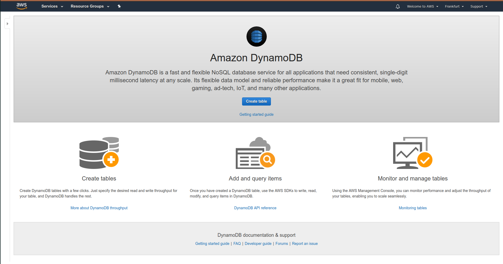
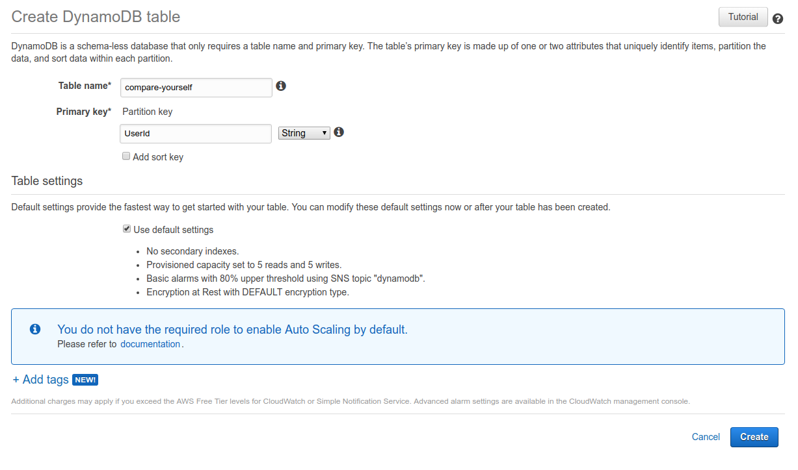
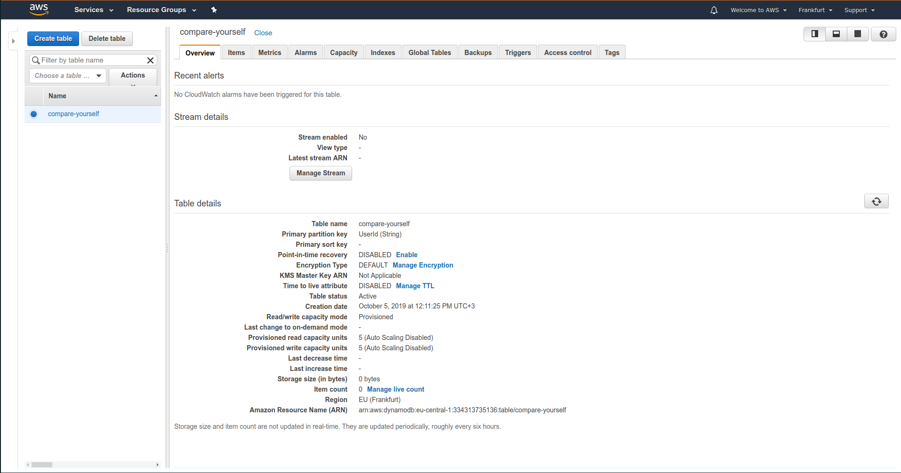

# Creating a table in DynamoDB

In `AWS services` we can search for `DynamoDB` and open it up.

Then simply click on creating a table. 

Under settings we can set indices and other settings as well.

When creating is finished, it will open up a dashboard for the table.

