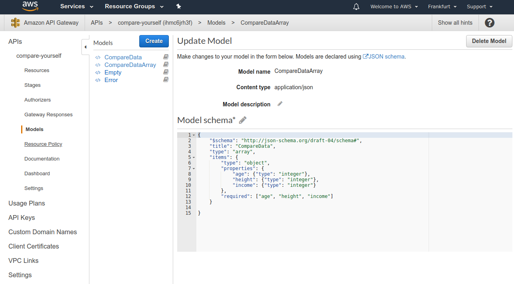
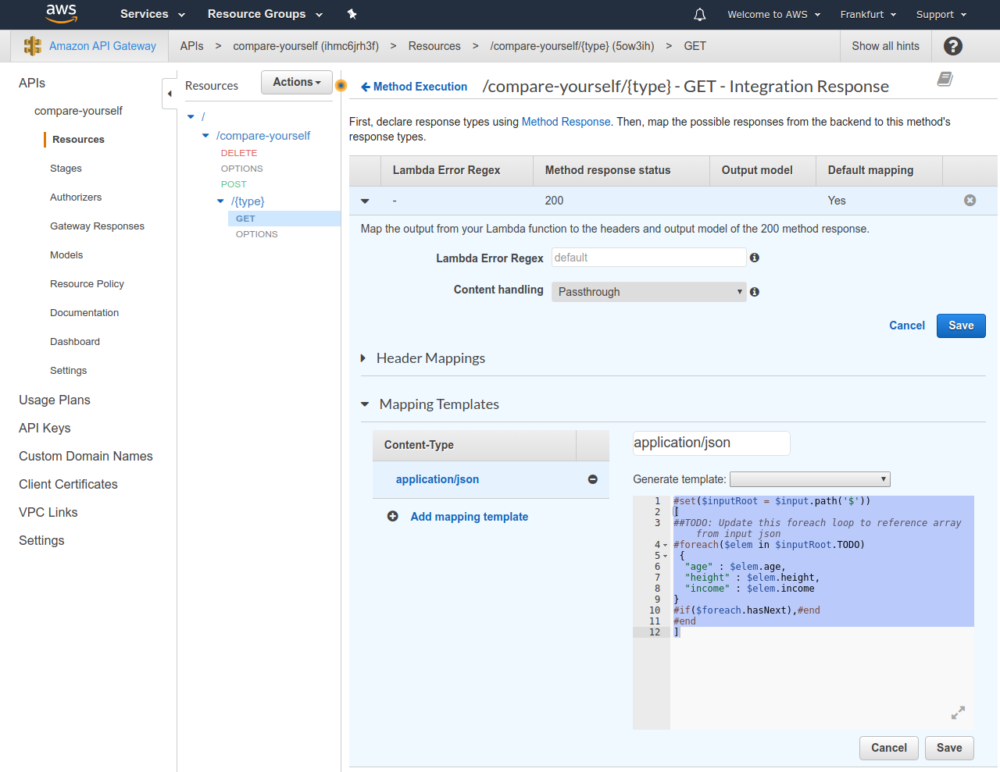

# Mapping responses

Wea are going to make a new Model `CompareDataArray` in the API Gateway like so:

```json
{
    "$schema": "http://json-schema.org/draft-04/schema#",
    "title": "CompareData",
    "type": "array",
    "items": {
        "type": "object",
        "properties": {
            "age": {"type": "integer"},
            "height": {"type": "integer"},
            "income": {"type": "integer"}
        },
        "required": ["age", "height", "income"]
    }
    
}
```



And then going to get method's `Integration Response -> Mapping Templates`.



```json
#set($inputRoot = $input.path('$'))
[
##TODO: Update this foreach loop to reference array from input json
#foreach($elem in $inputRoot.TODO)
 {
  "age" : $elem.age,
  "height" : $elem.height,
  "income" : $elem.income
} 
#if($foreach.hasNext),#end
#end
]
```