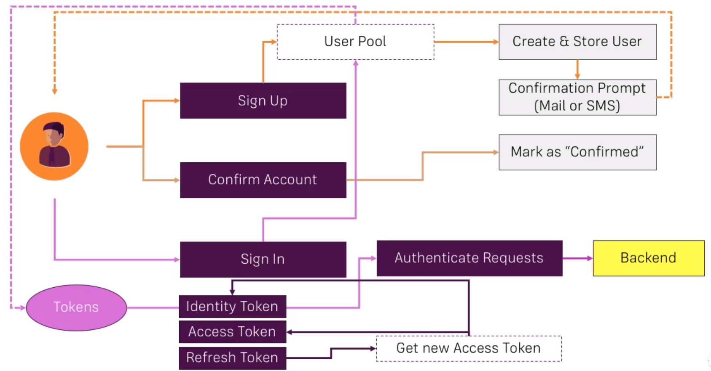

# What is Cognito

It is usefull when we want to add authentication to our web or mobile app. We can define how to authenticate users, store auth token on user devices.

You can set up cognito user pools as well as add third-party providers like facebook, google auth.

Overview: [https://aws.amazon.com/cognito/](https://aws.amazon.com/cognito/)

Documentation: [http://docs.aws.amazon.com/cognito/latest/developerguide/cognito-user-identity-pools.html](http://docs.aws.amazon.com/cognito/latest/developerguide/cognito-user-identity-pools.html)

## Cognito user pools and federated identities

User pools are solution for authentication process that is we don't want to add processes like auth with facebook or google.

Federated identities will allow to connect with Facebook, Google to generate temporary IAM credentials.

## Cognito Auth Flow

