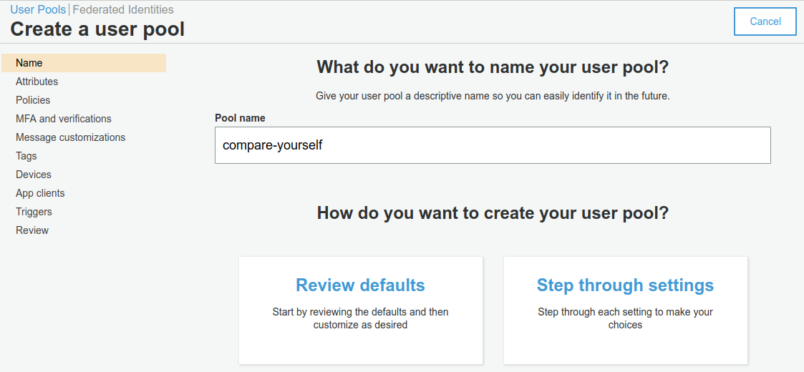
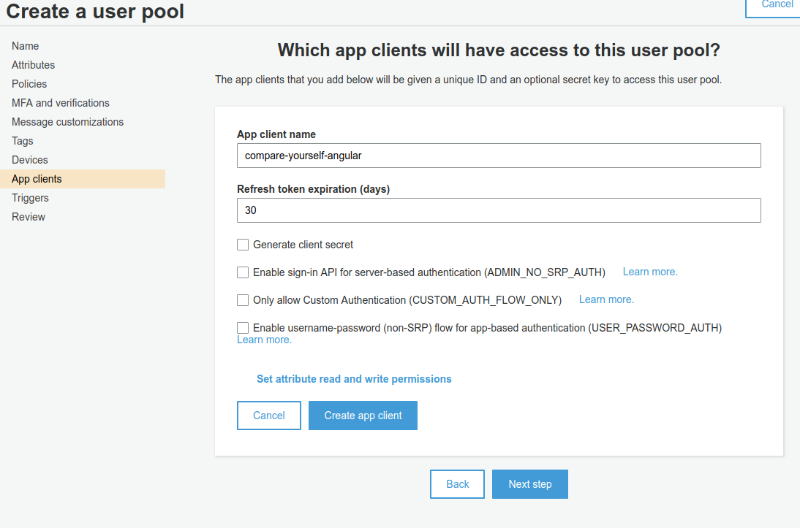

# Creating a cognito user pool

We can go to `AWS Console -> Cognito -> Manage User Pools` and click on `Create a user pool`.

Then you can enter a name and choose wether you want to choose all the default settings or tune them yourself.

