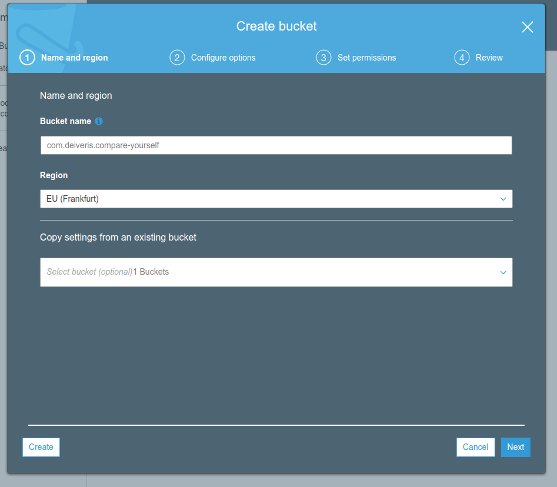
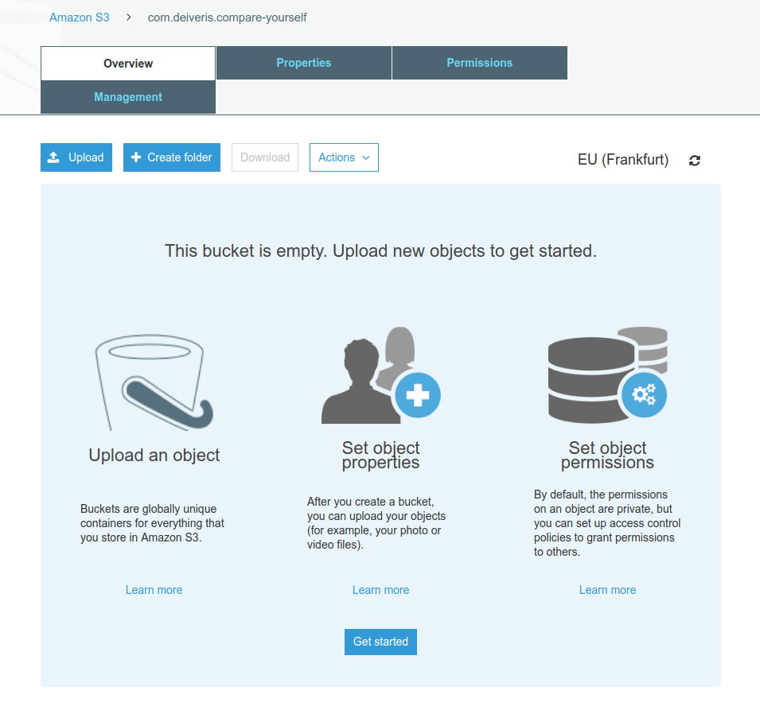

# Creating an S3 bucket

We can go to `AWS CONSOLE -> S3 -> Create bucket`.

We can configure the bucket in next steps like setting up:
- Versioning
- Access logging
- Tags
- Encryption
- Permissions

When done, we have created a bucket where we can upload files to:

