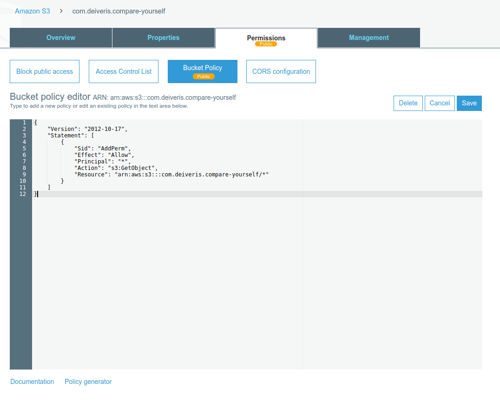
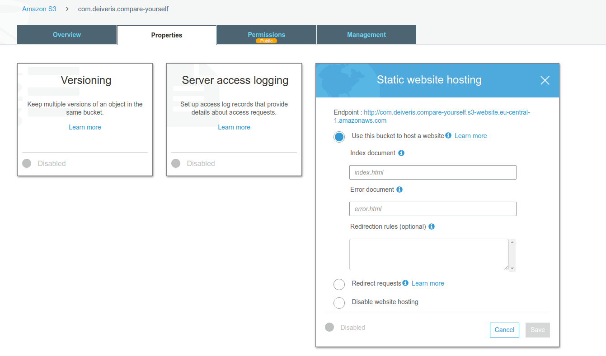
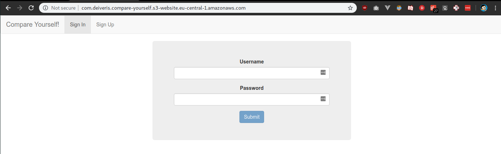

# Turning s3 into a static web server

You can go to permissions and clicking on `bucket policy` in s3 bucket and grant read-only permissions to an anonymous users.

```json
{
  "Version":"2012-10-17",
  "Statement":[
    {
      "Sid":"AddPerm",
      "Effect":"Allow",
      "Principal": "*",
      "Action":["s3:GetObject"],
      "Resource":["arn:aws:s3:::com.deiveris.compare-yourself/*"]
    }
  ]
}
```



Now we can go to `Properties` and enable static website hosting.



Now, if we open up the url provided after saving, we can see the web app

