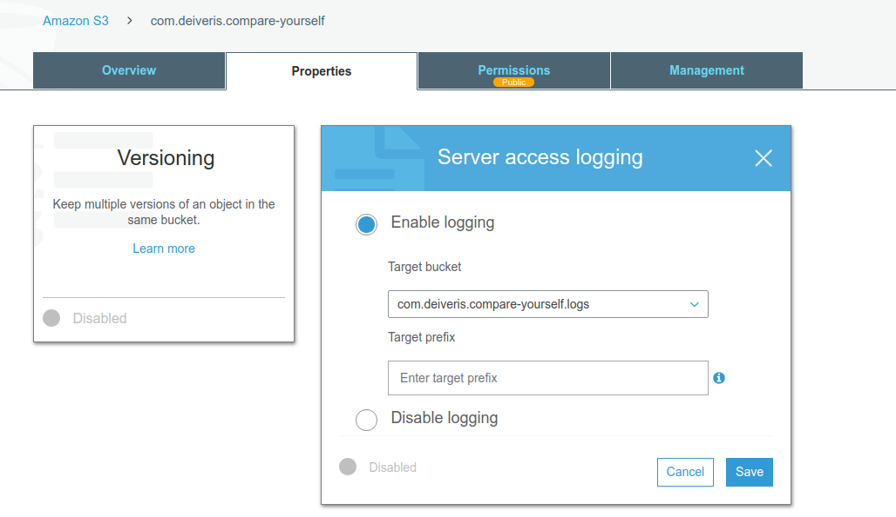

# Setting up logging

We can create a new bucket like `com.deiveris.compare-yourself.logs` and then going to `com.deiveris.compare-yourself` bucket, selecting `Properties -> Server access logging`.

Now the static webserver logs will be written into the other bucket.