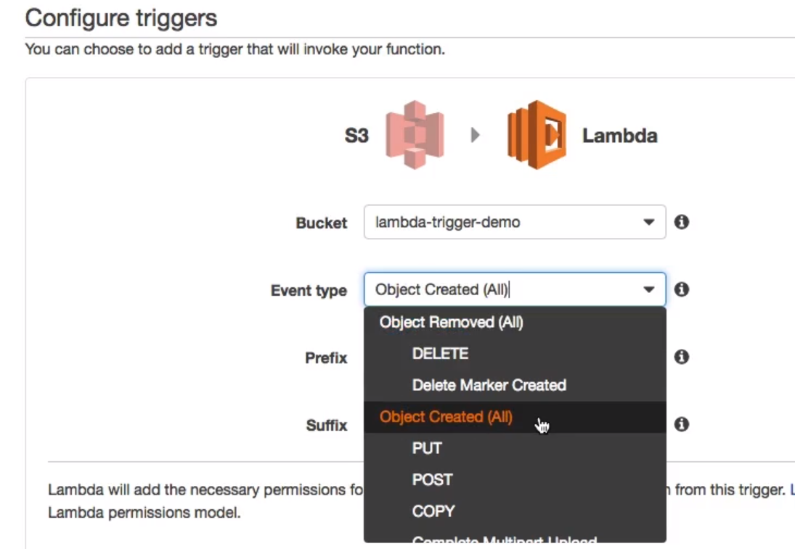

# Other AWS triggers

When creating a lambda function, you can select various triggers that are not only limited to http requests. We can also create a trigger for s3 file uploads, cloudwatch schedules etc.

