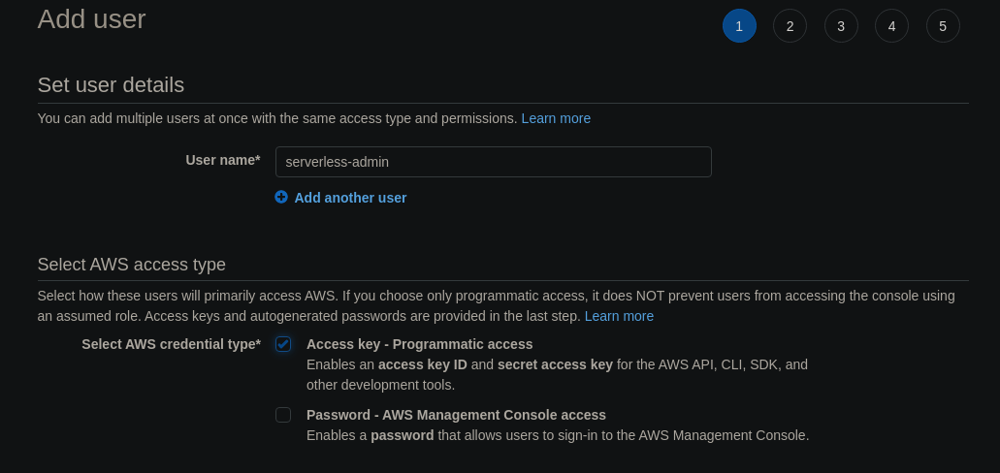
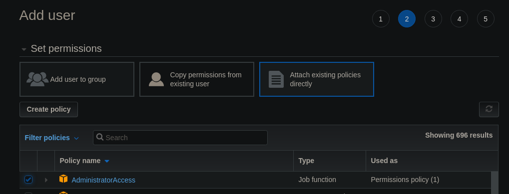

# The Serverless Framwork

- Serverless Framework (https://serverless.com) aims to ease the pain of creating, deploying, managing and debugging lambda functions.
- It integrates well with CI/CD tools
- It has CloudFormation support so your entire stack can be deployed using this Framework

## Installing Serverless

- Install dependencies (node & AWS CLI)
- Install the serverless framework
- Setting up AWS for the `serverless-admin` user
- Download credentials on your machine
- Setup Serverless to use these credentials

```
# 1. install node
# ...
# 2. install serverless
sudo npm i -g serverless
# 3. setup serverless
serverless config credentials --provider aws --key XXX --secret YYY --profile serverless-admin
```

For the access credentials we are going to create a new IAM user `serverless-admin`.


