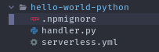
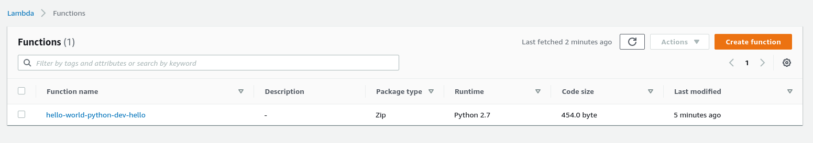
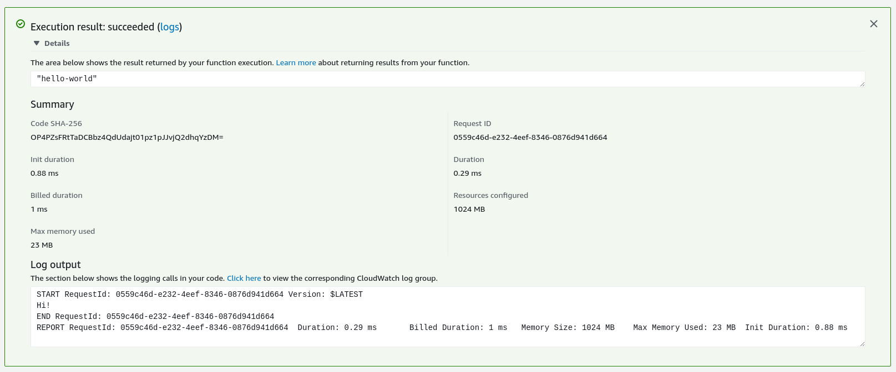

# Deploying Hello World Function Using Serverless

We are going to create an serverless project. We can use either `serverless` or `sls` command to do that.

```
➜  learning-serverless sls create --template aws-python --path hello-world-python
Serverless: Generating boilerplate...
Serverless: Generating boilerplate in "/home/davis/projects/learning-serverless/hello-world-python"
Serverless: Successfully generated boilerplate for template: "aws-python"

```

The command created a directory `hello-world-python` with 3 files - `.gitignore`, `handler.py` and `serverless.yaml`.



We are going to replace all the contents of the `handler.py` with:

```python
def hello(event, context):
    print("Hi!")
    return "hello-world"
```

Then we are going to add the profile and region to the serverless.yaml

```yaml
service: hello-world-python
frameworkVersion: '2'

provider:
  name: aws
  runtime: python2.7
  lambdaHashingVersion: 20201221
  profile: serverless-admin
  region: eu-west-1

functions:
  hello:
    handler: handler.hello
```

Then, we are going to deploy it:

```console
➜  learning-serverless git:(master) cd hello-world-python 
➜  hello-world-python git:(master) sls deploy -v
Serverless: Packaging service...
Serverless: Excluding development dependencies...
Serverless: Creating Stack...
Serverless: Checking Stack create progress...
CloudFormation - CREATE_IN_PROGRESS - AWS::CloudFormation::Stack - hello-world-python-dev
CloudFormation - CREATE_IN_PROGRESS - AWS::S3::Bucket - ServerlessDeploymentBucket
CloudFormation - CREATE_IN_PROGRESS - AWS::S3::Bucket - ServerlessDeploymentBucket
CloudFormation - CREATE_COMPLETE - AWS::S3::Bucket - ServerlessDeploymentBucket
CloudFormation - CREATE_IN_PROGRESS - AWS::S3::BucketPolicy - ServerlessDeploymentBucketPolicy
CloudFormation - CREATE_IN_PROGRESS - AWS::S3::BucketPolicy - ServerlessDeploymentBucketPolicy
CloudFormation - CREATE_COMPLETE - AWS::S3::BucketPolicy - ServerlessDeploymentBucketPolicy
CloudFormation - CREATE_COMPLETE - AWS::CloudFormation::Stack - hello-world-python-dev
Serverless: Stack create finished...
Serverless: Uploading CloudFormation file to S3...
Serverless: Uploading artifacts...
Serverless: Uploading service hello-world-python.zip file to S3 (454 B)...
Serverless: Validating template...
Serverless: Updating Stack...
Serverless: Checking Stack update progress...
CloudFormation - UPDATE_IN_PROGRESS - AWS::CloudFormation::Stack - hello-world-python-dev
CloudFormation - CREATE_IN_PROGRESS - AWS::Logs::LogGroup - HelloLogGroup
CloudFormation - CREATE_IN_PROGRESS - AWS::IAM::Role - IamRoleLambdaExecution
CloudFormation - CREATE_IN_PROGRESS - AWS::IAM::Role - IamRoleLambdaExecution
CloudFormation - CREATE_IN_PROGRESS - AWS::Logs::LogGroup - HelloLogGroup
CloudFormation - CREATE_COMPLETE - AWS::Logs::LogGroup - HelloLogGroup
CloudFormation - CREATE_COMPLETE - AWS::IAM::Role - IamRoleLambdaExecution
CloudFormation - CREATE_IN_PROGRESS - AWS::Lambda::Function - HelloLambdaFunction
CloudFormation - CREATE_IN_PROGRESS - AWS::Lambda::Function - HelloLambdaFunction
CloudFormation - CREATE_COMPLETE - AWS::Lambda::Function - HelloLambdaFunction
CloudFormation - CREATE_IN_PROGRESS - AWS::Lambda::Version - HelloLambdaVersionpC2AzkyzeFlxav73Mzt7weVZ7YH18lex6bRJ5zN0SE
CloudFormation - CREATE_IN_PROGRESS - AWS::Lambda::Version - HelloLambdaVersionpC2AzkyzeFlxav73Mzt7weVZ7YH18lex6bRJ5zN0SE
CloudFormation - CREATE_COMPLETE - AWS::Lambda::Version - HelloLambdaVersionpC2AzkyzeFlxav73Mzt7weVZ7YH18lex6bRJ5zN0SE
CloudFormation - UPDATE_COMPLETE_CLEANUP_IN_PROGRESS - AWS::CloudFormation::Stack - hello-world-python-dev
CloudFormation - UPDATE_COMPLETE - AWS::CloudFormation::Stack - hello-world-python-dev
Serverless: Stack update finished...
Service Information
service: hello-world-python
stage: dev
region: eu-west-1
stack: hello-world-python-dev
resources: 6
api keys:
  None
endpoints:
functions:
  hello: hello-world-python-dev-hello
layers:
  None

Stack Outputs
HelloLambdaFunctionQualifiedArn: arn:aws:lambda:eu-west-1:539690530154:function:hello-world-python-dev-hello:1
ServerlessDeploymentBucketName: hello-world-python-dev-serverlessdeploymentbucket-1gnp3uaf77yre

Serverless: Deprecation warning: Starting with v3.0.0, "-v" will no longer be supported as alias for "--verbose" option. Please use "--verbose" flag instead.
            More Info: https://www.serverless.com/framework/docs/deprecations/#CLI_VERBOSE_OPTION_ALIAS

Toggle on monitoring with the Serverless Dashboard: run "serverless"
```

Now if we go to our Lambda console, we'll see the created function.



And if we test it, it will print the `Hi!`, return `hello-world`.

