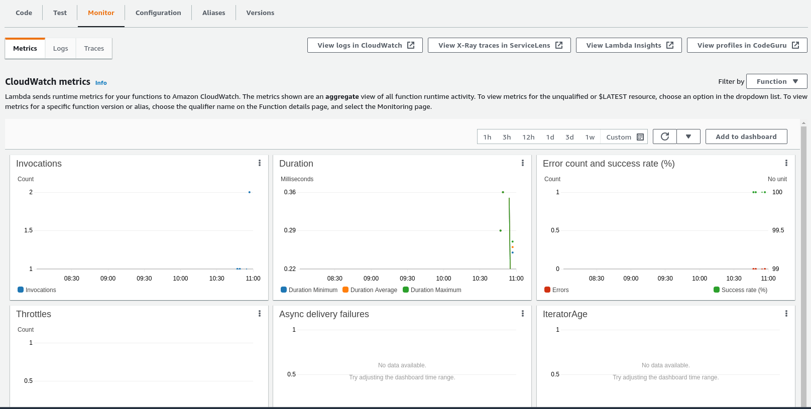
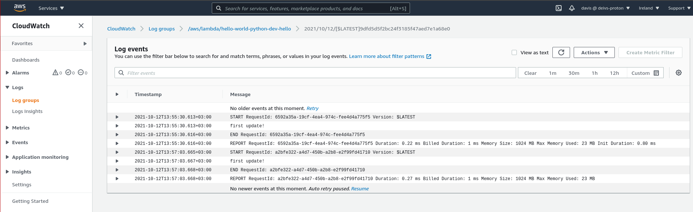

# Fetching function logs from the CLI

## View function logs in AWS CloudWatch logs

We can open up the `Monitoring` tab in the function and see some metrics.



To see the logs, we can click on the `View logs in CloudWatch` button.

There will be a list of requests that we can get logs for. Choose one of them.



## Stream function logs to our computer using Serverless

```console
➜  hello-world-python git:(master) ✗ sls logs -f hello -t
START RequestId: 00d945d0-ea90-4a75-a935-dc895480109e Version: $LATEST
second update!
END RequestId: 00d945d0-ea90-4a75-a935-dc895480109e
REPORT RequestId: 00d945d0-ea90-4a75-a935-dc895480109e  Duration: 0.22 ms       Billed Duration: 1 ms   Memory Size: 1024 MB    Max Memory Used: 23 MB       Init Duration: 0.66 ms
```

Note, that this will stream the logs as they happen. It will continuously poll for new logs and show them.