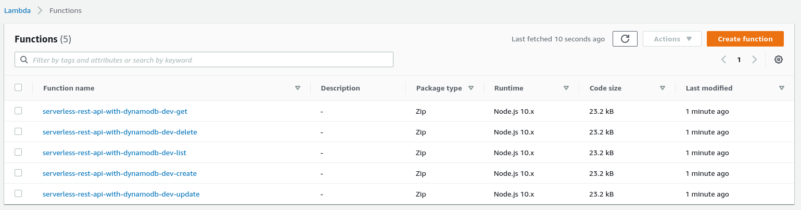
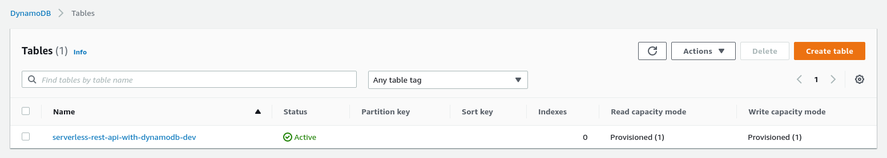
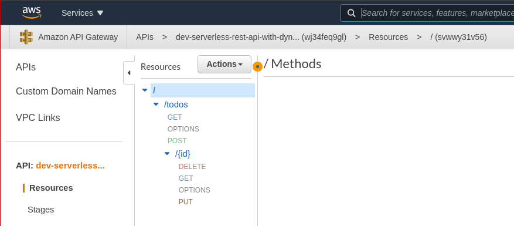

# Deploying the REST API

Once the service is set up, we can deploy it.

```console
sls deploy -v
```

Once deployed, we'll see our 5 lambda functions:



There will be a dynamoDB table setup:



And API Gateway routes:



--- 

