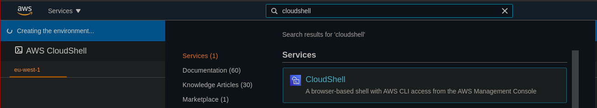
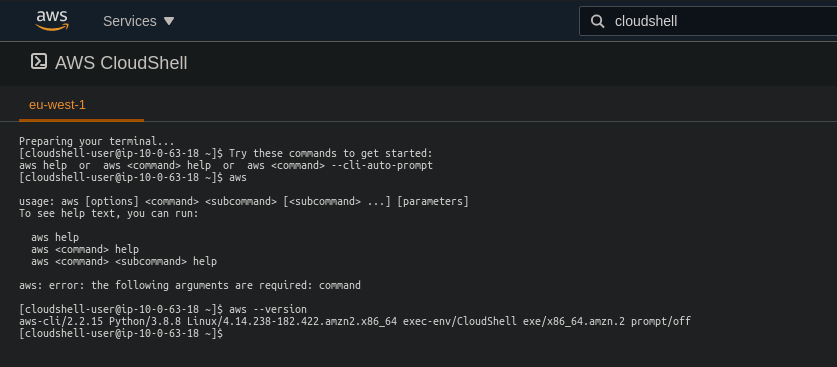
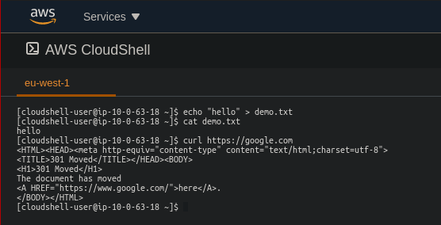
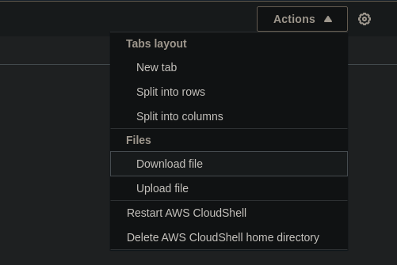
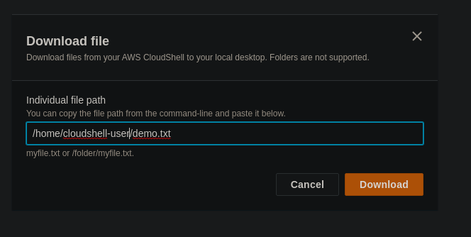

# AWS CloudShell

AWS CloudShell is an alternative for using a terminal issue aws commands.
Currently it is only available on a few regions though: https://docs.aws.amazon.com/cloudshell/latest/userguide/supported-aws-regions.html

You can access it via the management console.

It will probably take a minute to load on the first time. But after that a terminal will open up.

It can be used like any ordinary linux shell, not just for aws commands.

You can also upload and download files from the shell via the actions button on the right side.

