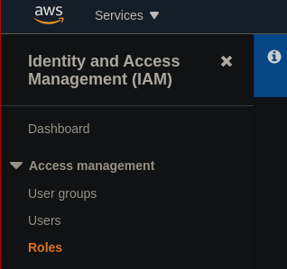
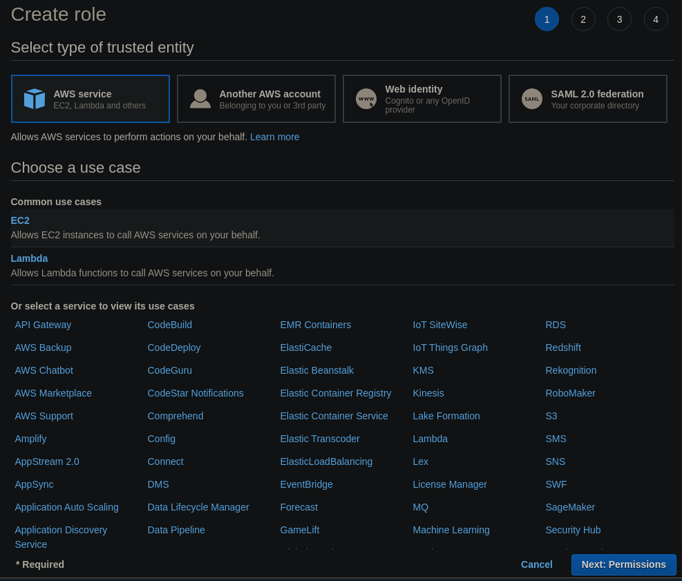
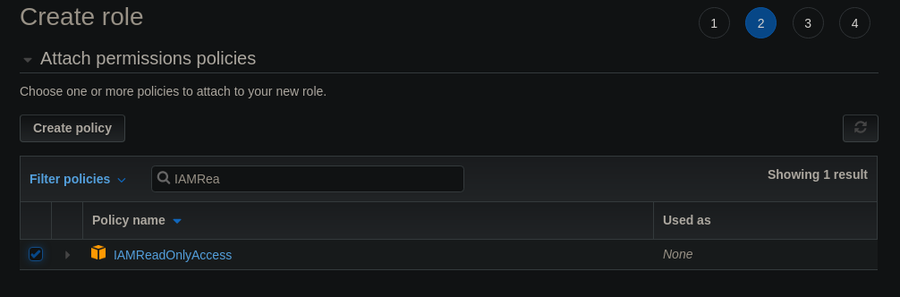
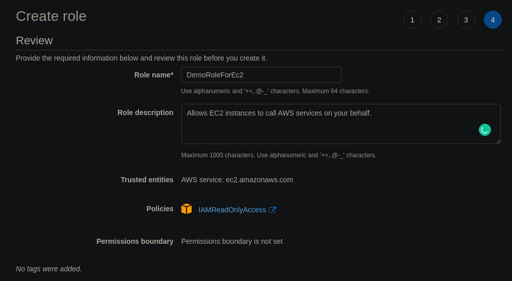

# IAM Roles Hands On

On the left side of the IAM we have a section called `Roles`.

We are going to create a new role. There is a button on the right side for it.
This will be a role for an AWS Service, we are going to select the `EC2 Instance` type below.

In the next step we can attach the necessary permissions, we are going to select `IAMReadOnlyAccess` and click next.

We are going to skip the tag step and then we are going to give it a name `DemoRoleForEC2`.

