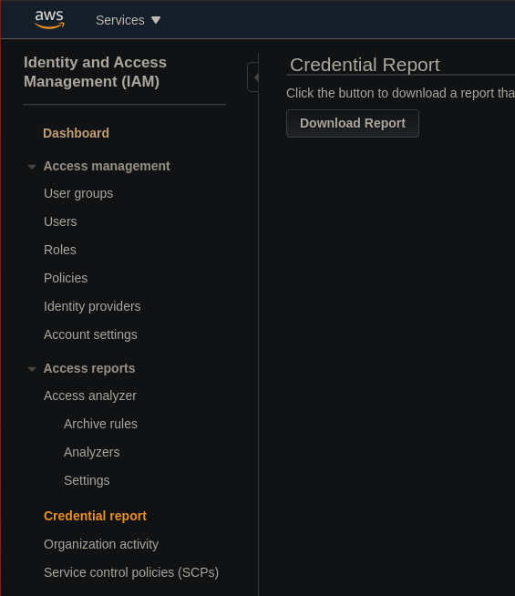
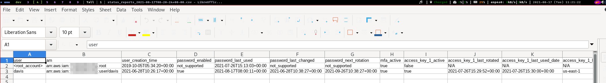
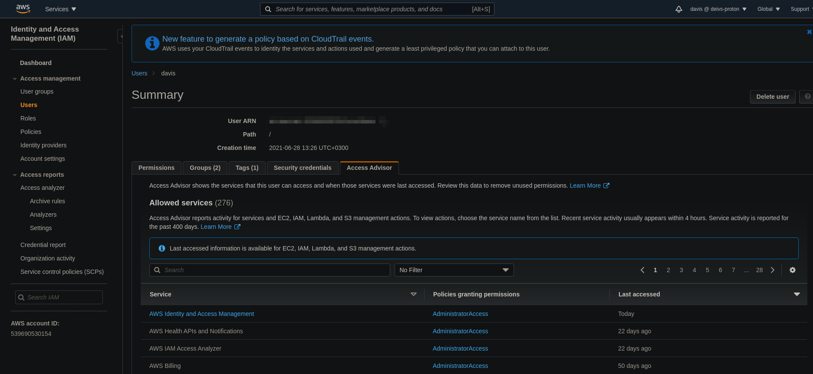

# IAM Security Tools Hands On

## Credential Report

In the IAM, we can access the `Credential Report` on the left side-menu.

Then click on the `Download Report`. It will give us a CSV file with a information like:

- User created at
- Is password enabled
- Is MFA enabled
- Are access keys active

## Access Advisor

This tool can be accessed by opening up a user in the IAM and going to `Access Advisor` tab.

Here we can see all the allowed services and when they were last accessed.