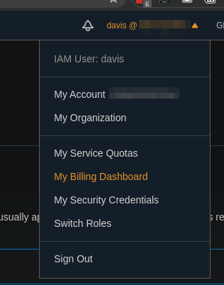
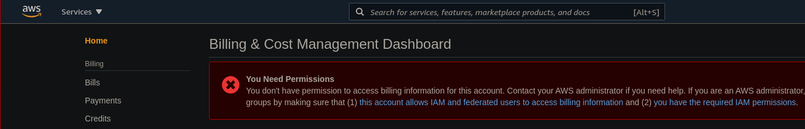
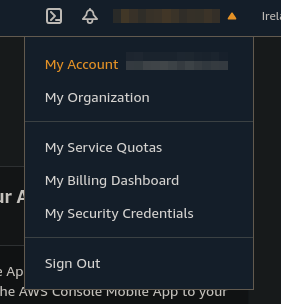
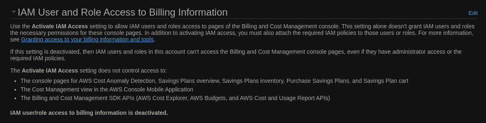
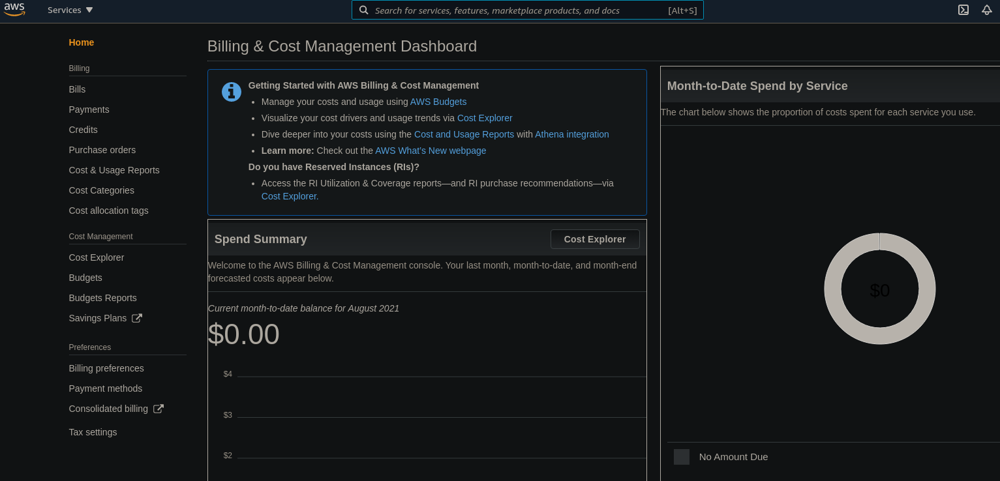
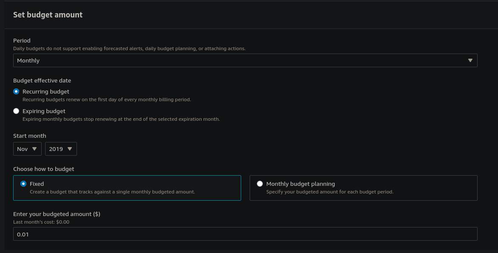
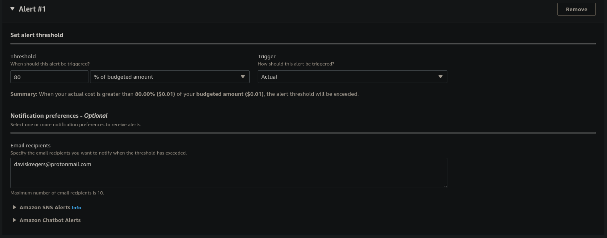

# AWS Budget Setup

In order not to spend too much, we are first going to set up a budget.

When you are logged into your AWS account, click on your username and go to `My Billing Dashboard`.

When you are visiting the billing page, an error might come up saying that you need permissions.

This can be fixed by accessing your root account. Then click on our username and go to `My Account`.

We are going to scroll down and access the page called `IAM User And Role Access To Billing Information`. Then we are going to activate it.

After that, we can access the billing information with users that have the IAM permissions set, e.g., administrators.

Here we cann view all the bills that we have previously had, explore the costs etc. 

We are going to open up the `Budgets` section and add a new budget, with a type `Cost Budget`. We are going to set up a monthly recurring budget with a fixed amount that we are willing to spend each month.

In the next step we can configure thresholds. This is for configuring notifications that will alert you that you have reached a certain threshold in your spending.

