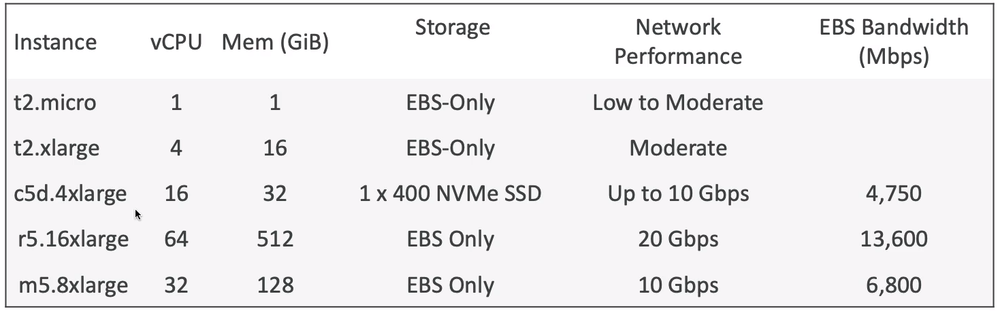

# EC2 Basics

EC2 is one of the most popular of AWS' offerings. It stands for Elastic Compute Cloud, is used for Infrastructure as a Service on AWS.

It mainly consists of capability of:
- Renting virtual machines (EC2)
- Storing data on virtual drives (EBS volumes)
- Distributing load accross machines (ELB - Elastic Load Balancer)
- Scaling the services using an auto-scaling group (ASG)
- Knowing EC2 is fundamental to understand how the Cloud works

## EC2 sizing & configuration options

- Operating system (OS): Linux, Windows or Mac OS
- How much compute power & cores (CPU)
- How much random-access memory (RAM)
- How much storage space:
    - Network-attached (EBS&EFS)
    - Hardware (EC2 Instance Store)
- Network card: speed of the card, public IP address
- Firewall rules: security group
- Bootstrap script (configure at first launch): EC2 User Data

## EC2 User Data

It's possible to bootstrap our instances using an EC2 User data script. This means launching commands when a machine starts on the first launch of the instance.

EC2 user data is used to automate boot tasks like:
- Installing updates
- Installing software
- Downloading common files from the internet

One thing to remember is that the EC2 data script runs with the root user.

## EC2 instance types: example

The t2.micro is part of the AWS free tier (up to 750 hours per month).

