# Create an EC2 instance with EC2 user data to have a webiste hands on

- We'll be launchin our first virtual server using AWS Console.
- We'll get a first high-level approach to the various parameters
- We'll see that our web server is launched using EC2 user data
- We'll learn how to start / stop / terminate our instances.

We are going to the `EC2 console` by typing `EC2` in the search bar.
Once that's done we are going to launch a new instance, but before you do - make sure you have selected a region that is most suitable for you.

Creating a new instance can be done by navigating to Instances page and clicking on the launch instance button.

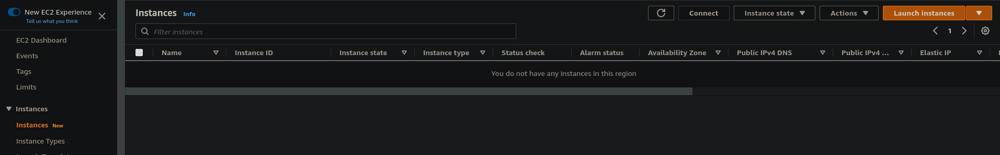

First, we have to choose the AMI - Amazon Machine Image. We can use the quick start AMIs like Amazon Linux, macOs etc. There is also an option to choose from my own created AMIs, market places AMIs and community AMIs.

We are going to select the Amazon Linux from the quick start page as it is free tier eligible.

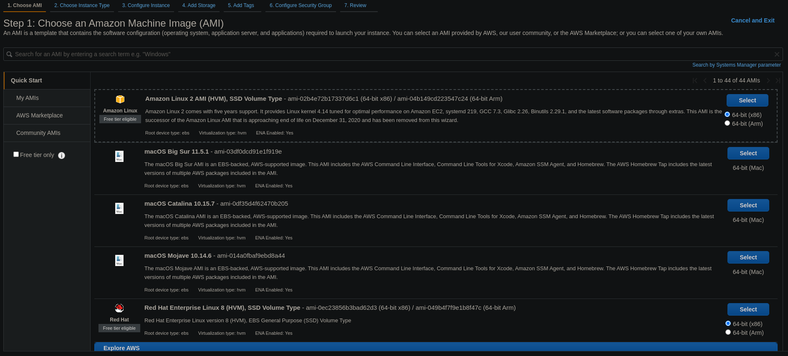

On the next step we can select the instance type which basically tells how much compute power, memory and network capability we have.

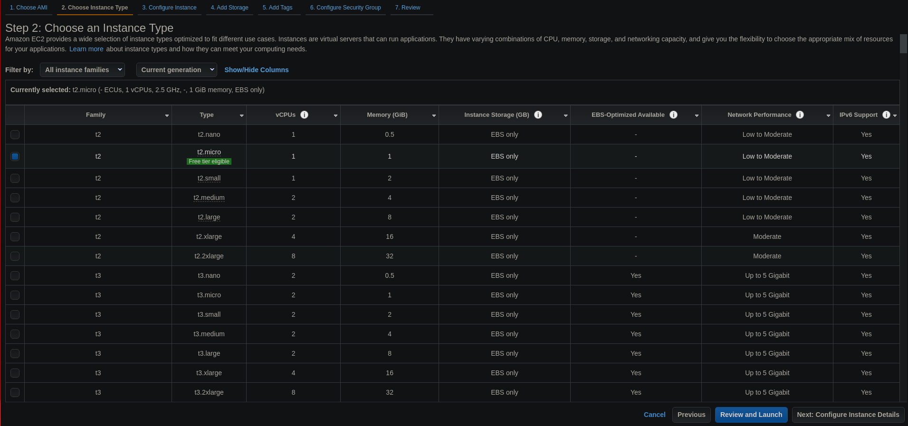

We are going to use the `t2.micro` one.

On the next step we have an option to change the instance details. Here we can configure things like how many instances we want to launch, the network configuration, IAM roles, file systems. We are going to leave everything as is except for one thing we are interested in - the user data field.

We are going to use the following script:

```bash
#!/bin/bash
# Use this for your user data

yum update -y
yum install -y httpd
systemctl start httpd
systemctl enable httpd
echo "<h1>Hello World from $(hostname -f)</h1>" > /var/www/html/index.html
```

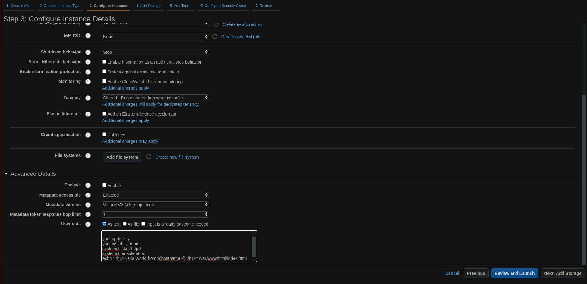

Then, the next step is to configure storage. We can configure how much storage we will have available on the instance, the speed of it as well as an option to encrypt it, delete on instance termination.

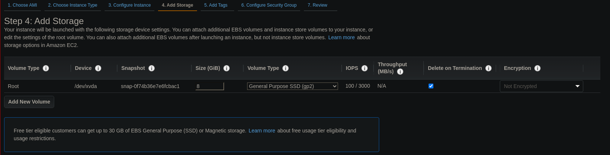

The next step is to add tags to our EC2 instance.

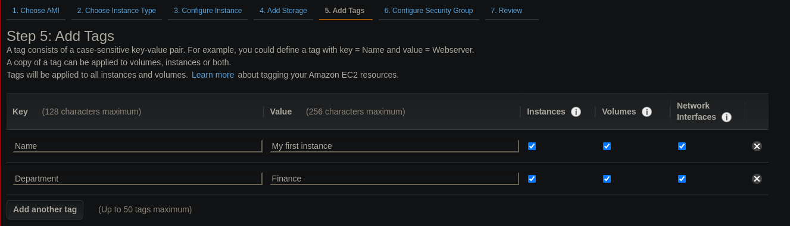

Then, we can configure the security group. We can use an existing security group or configure a new one. We are going to create a new one and allow the HTTP (port 80) to go through.

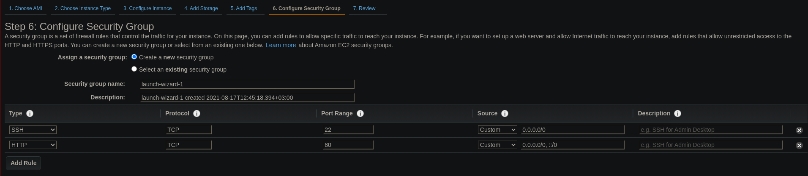

The next step is to simply review what we are creating. Once we're ready, we click on launch.

When we launch it, we need to select a key pair. It is used for SSH when we are trying to log into our instance. We are going to create a new one and download it. Make sure not to lose the file.

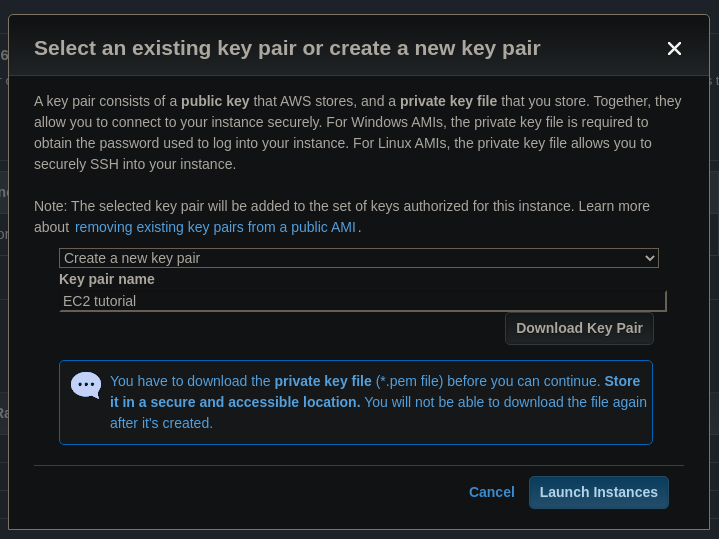

After that, our instance will be in the creation process. It will probably take a minute for it to go live.

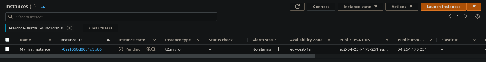

Once it's ready, we can view the details of the instance. There will be a field with a public IP address. If we open up that IP address in the browser, it will show our new website. (note that the link next to the public ip address might not work as it will use `https://` instead of `http://`)

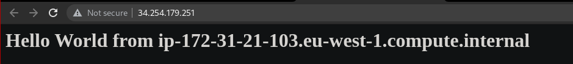

---

We can stop the instance by selecting it and and choosing clicking on the `Instance State`, selecting the `Stop instance` option. (This can also be done by right-clicking on the instance).

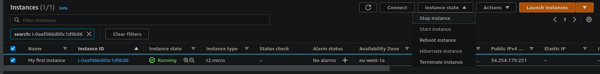

If we try to connect to the same webpage again, we won't be able to as the instance is stopped.

In order to get rid of the instance - we can select the `Terminate Instance` option. It will delete it.

Note, that when you stop the instance and start it again, you'll get a new Public IP Address.