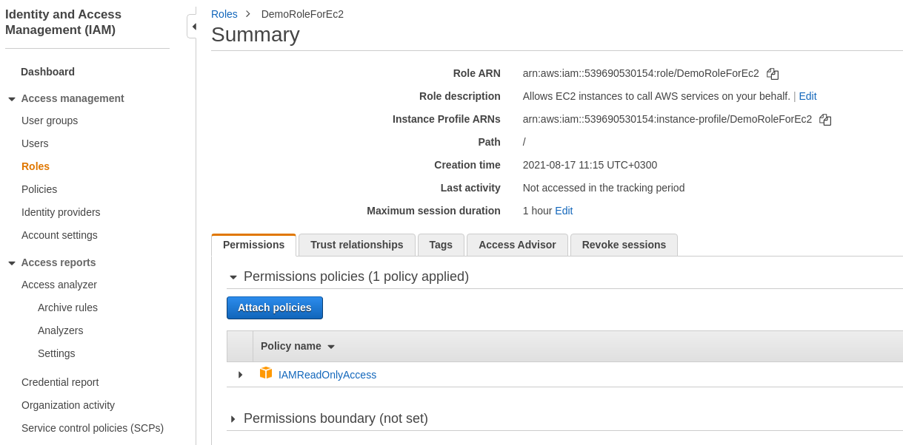
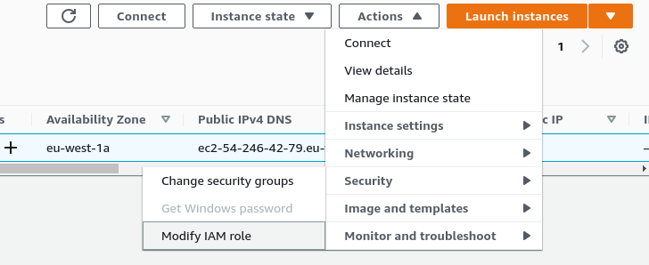
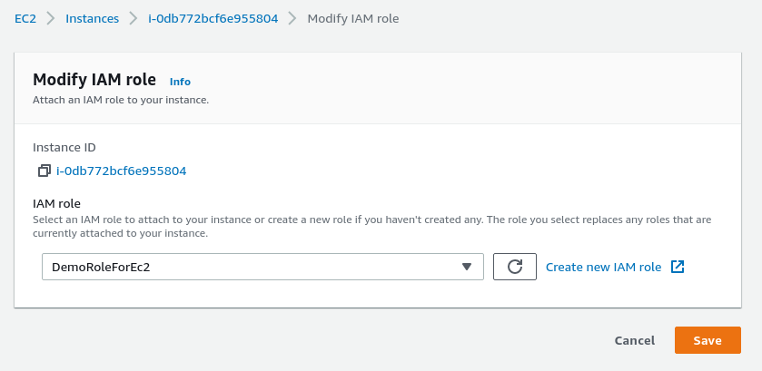
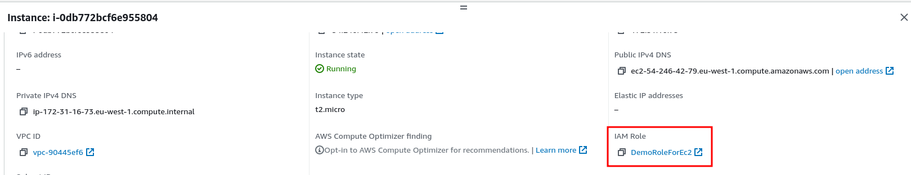
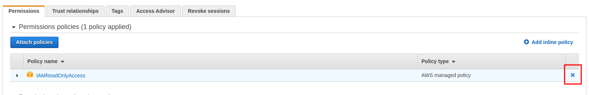

# EC2 Instance Roles Demo

For this demo we are going to SSH into our EC2 instance.

The Amazon Linux comes with aws cli pre-installed.

```
[ec2-user@ip-172-31-16-73 ~]$ aws --version
aws-cli/1.18.147 Python/2.7.18 Linux/4.14.243-185.433.amzn2.x86_64 botocore/1.18.6
```

So, we can start using it.

```
[ec2-user@ip-172-31-16-73 ~]$ aws iam list-users
Unable to locate credentials. You can configure credentials by running "aws configure".
```

We can configure this by using the `aws configure` and providing the access credentials, **but but that really is a bad idea**.

The reason for that is that anyone with the access to the aws account can connect into the instance and retrieve your private credentials.

The other way to do this is to use IAM roles.

In the [previous sections](../03-iam-and-aws-cli/11-iam-roles-hands-on.md) we created an IAM role with a read only access to IAM.



We are going to attach it to the EC2 instance. That can be done by selecting an EC2 instance and clicking on `Actions -> Security -> Modify IAM role`.



And there we are going to select the role:



It should be visible under instance details now:



If we try try the same command now, it will work:

```
[ec2-user@ip-172-31-16-73 ~]$ aws iam list-users
{
    "Users": [
        {
            "UserName": "davis",
            ...
```

If we were to detach the permission now.



```
[ec2-user@ip-172-31-16-73 ~]$ aws iam list-users

An error occurred (AccessDenied) when calling the ListUsers operation: User: arn:aws:sts::539690530154:assumed-role/DemoRoleForEc2/i-0db772bcf6e955804 is not authorized to 
perform: iam:ListUsers on resource: arn:aws:iam::539690530154:user/
```

If you were to add it once more, there might be a situation that you cannot connect right away. It might take a second to apply the changes.