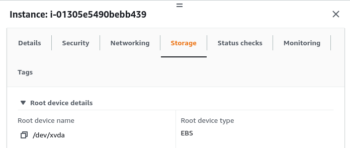
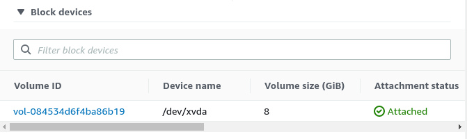
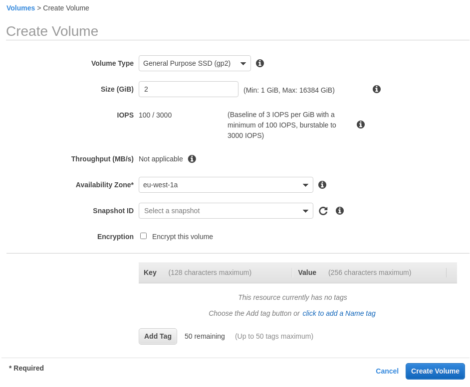
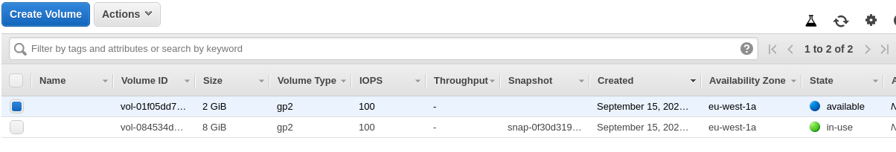
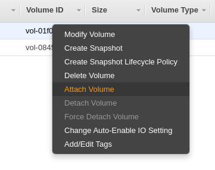
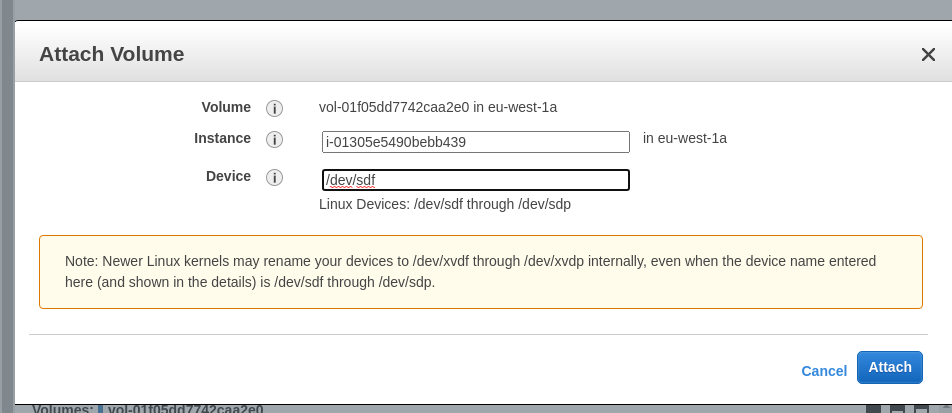
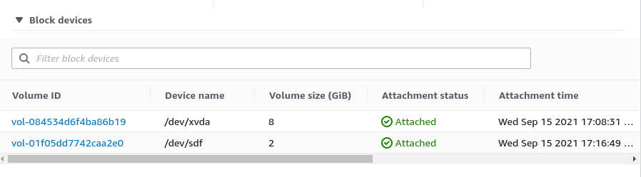

# EBS Hands On

If we go to EC2 and inspect our instance, under the storage tab, we'll see that it has a root device with a type of EBS volume.

Also there is a section `Block devices` that will lost all attached storages. Currently we only have the root device.

We can also go to `EC2 -> Elastic Block Store -> Volumes` and create a new volume.

We are going to create a 2 GB General purpose storage in the same availability zone that our ec2 instance is located in.

Now we'll see 2 volumes in our list - one is in use (the root volume) and one that is available (the one we created just now).

We can now attach our volume to the EC2 instance by right-clicking.

Now under the instance, we'll see both of these volumes:

