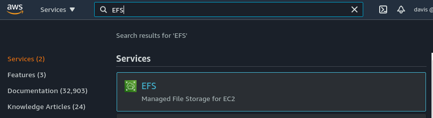
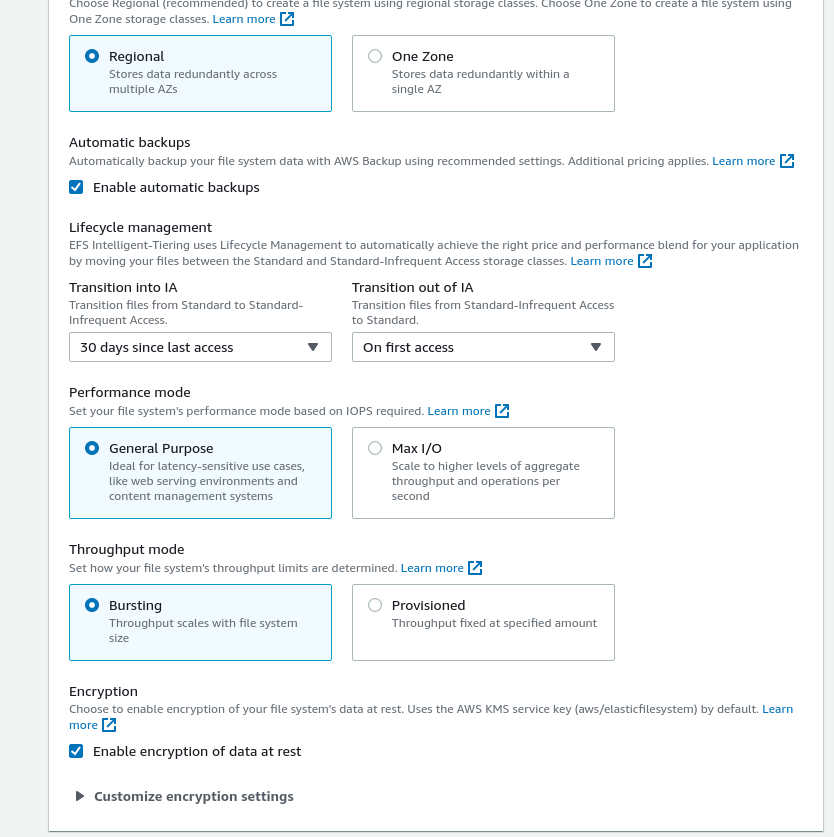
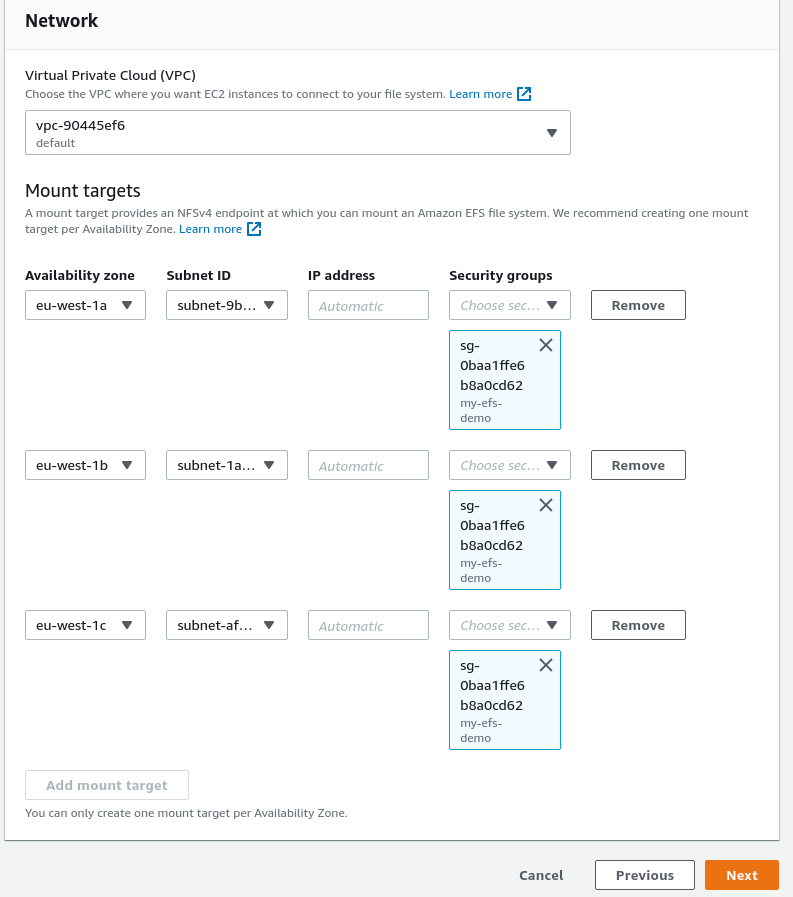
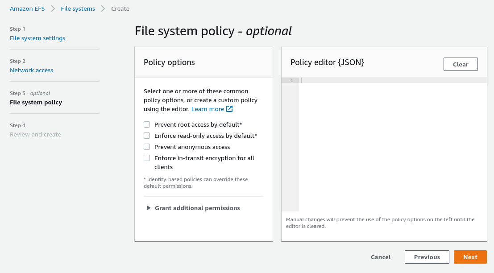
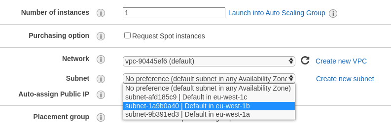
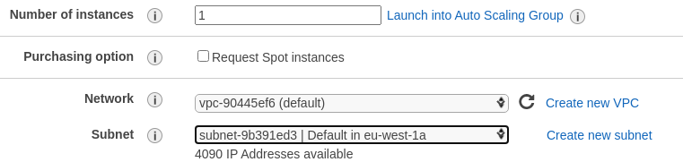
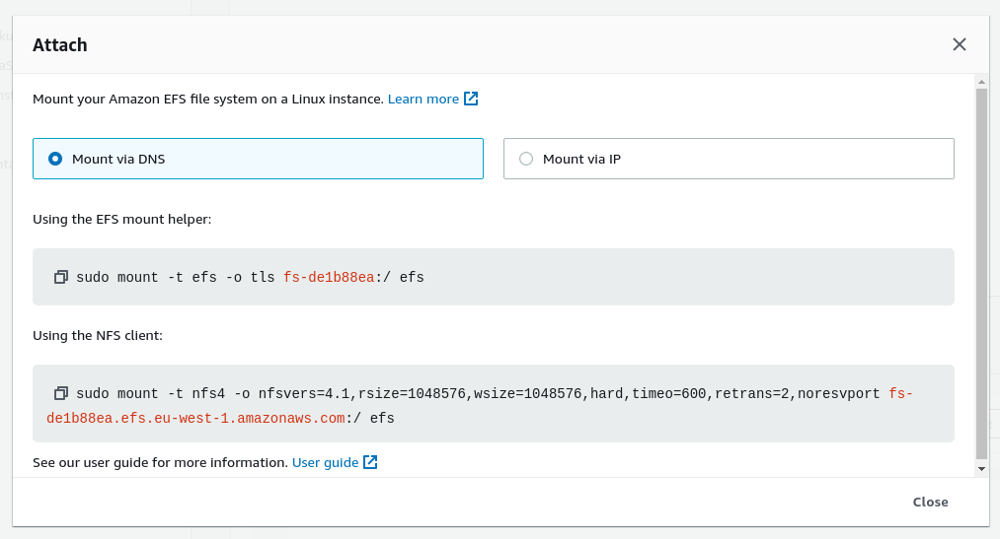
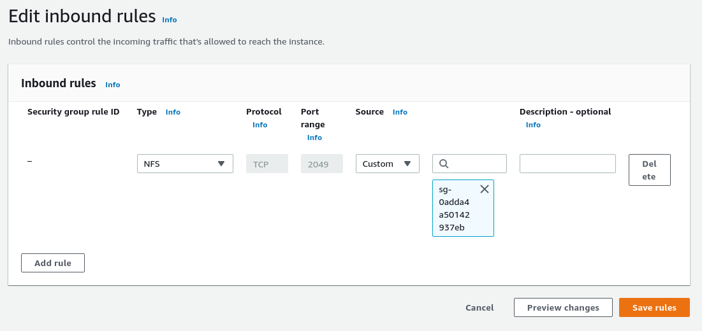
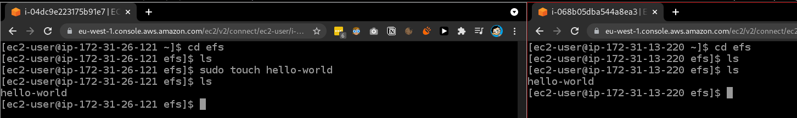

# EFS hands on

In order to work with EFS we can navigate to it in the search bar.



Then we are going to click on the `Create a file system`, to see all the options we are going to use the `Customize` button.

On the first step we can set the name as well as various settings like regions, lifecycles and performance.



The next step is where we can configure mounting it accross multiple availability zones.

Before we make any changes we are going to create an empty security grop called `my-efs-demo`.

Then we are going to remove all the default security groups and change them to the newly created one.



The next step is file system policy which is optional. We are going to skip it.



Once that is created, we are going to create 2 EC2 instances that are going to access the EFS volume.

The first one will be located in eu-west-1b.



The secon one will be placed in eu-west-1a.



Both of them will reuse the same security grop `ec2-to-efs`.

---

Now we can open up the EFS and click on attach.
This will give us instructions on how to mount the file system.



In order to use the efs mount helper we need to install it on our ec2 instance:

```bash
sudo yum install -y amazon-efs-utils
```

Then we can set it up

```bash
mkdir efs
sudo mount -t efs -o tls fs-de1b88ea:/ efs
```

We might receive a timeout when trying to mount it. To fix that, we are going to edit the `my-efs-demo` security group and add an inboud NFS rule with a source of `ec2-to-efs` security group.



Now it should be working:

