# Amazon RDS Hands On

We can open up the RDS service in AWS

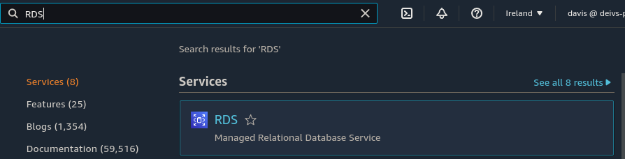

And go to the `databases` secion and click on create database

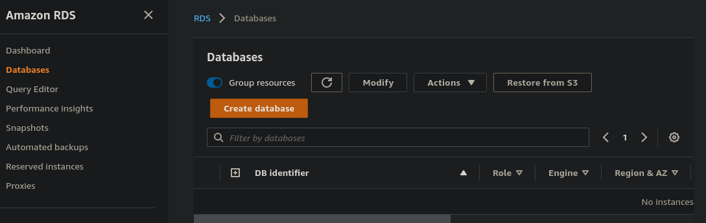

There will we have different options:

- We can choose the creation method:

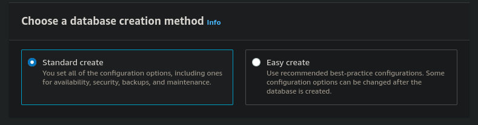

We are going to choose the standard one. In it the first choice to make is to pick a database engine:

- Amazon Aurora
- MySQL
- MariaDB
- PostgreSQL
- Oracle
- Microsoft SQL Server

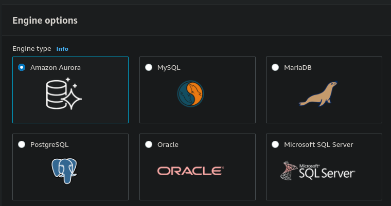

We are going to select MySQL and select the latest version.

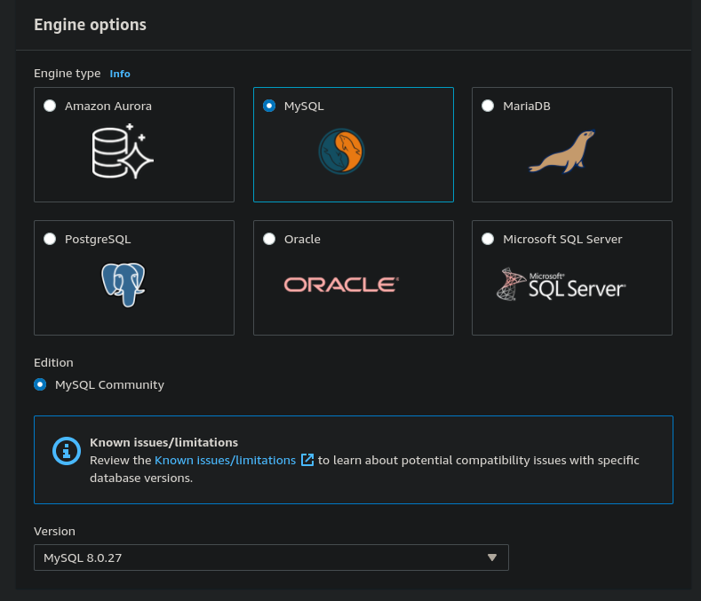

Next we can choose between some templates that will be pre-filling the following configurations with best suited values. We are going to use the Production one but modify it to be compliant with free tier.

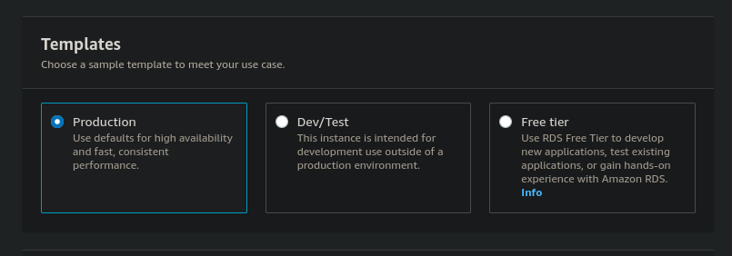

Next we can choose our availability and durability settings. For free tier pick Single DB Instance.

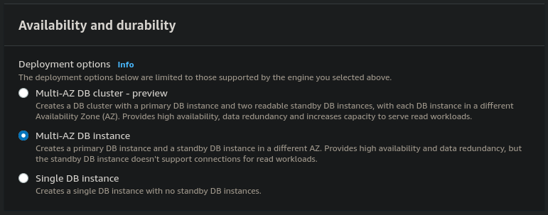

In the settings section we can set the identifier, username and password.

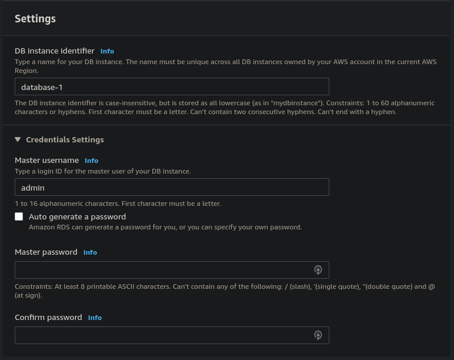

Next we can choose the instance types. For free tier use db.t2.micro
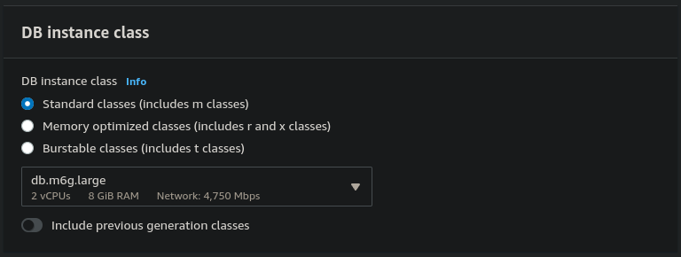

Next we can choose the storage type. For free tier use gp2. You can also set the allocated storage and enable storage autoscaling.

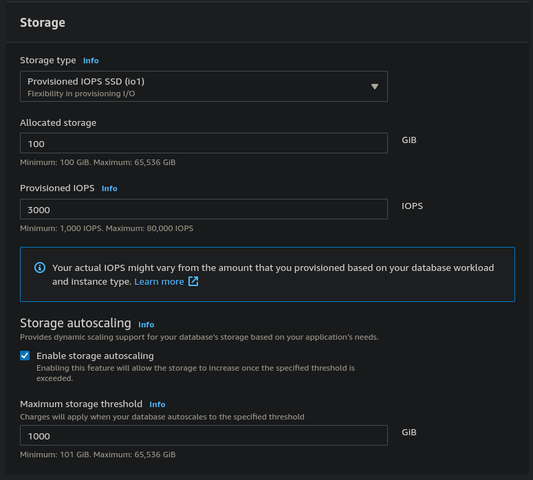

In the connectivity section we can choose the VPC the database will be placed into. Whether the database is publicly available. The security groups and port under additional configuration.

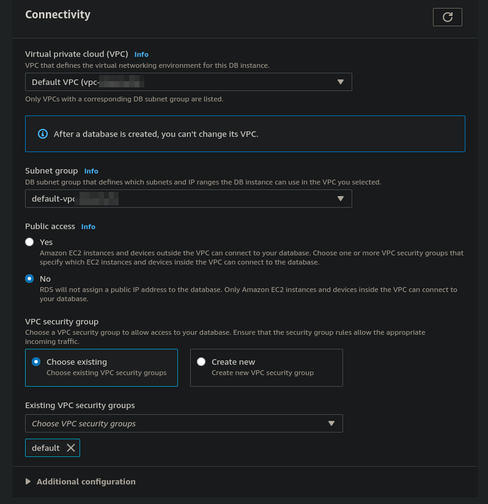

We can also choose the authentication methods.

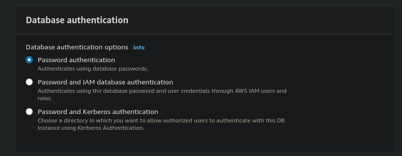

Under the additional configuration we can:

Set the initial database name, parameter groups, option groups.

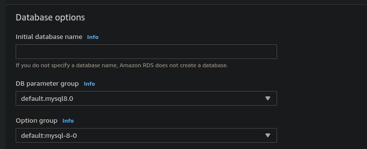

Configure backups

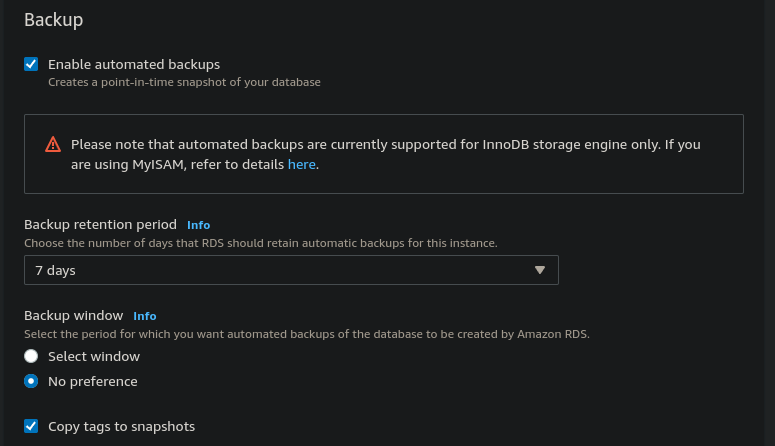

Configure encryption

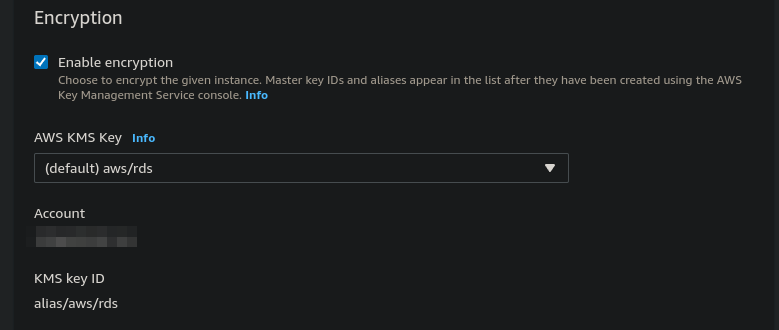

Enable performance insights

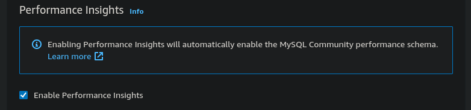

Configure retention period

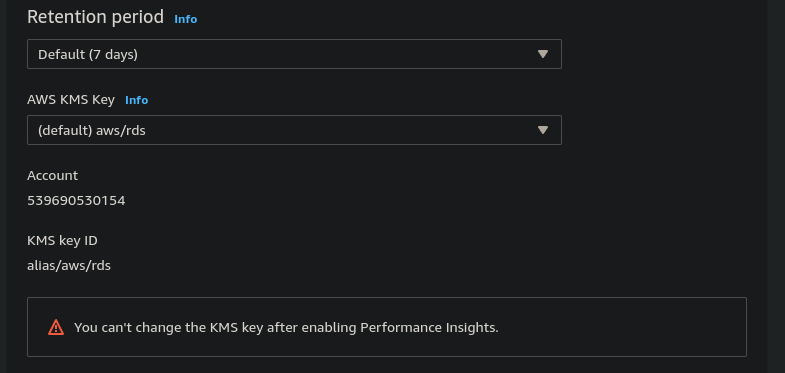

Configure monitoring

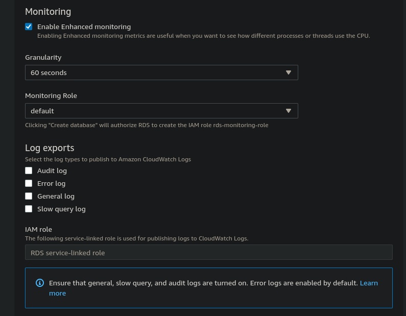

Configure maintenance and toggle deletion protection

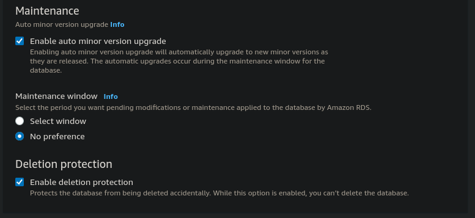

---

Once done setting up, we can click on create the database and it will show up on the databases section wth a status of `creating`.

It can take a few minutes for it to be ready.

Once it's done, we can open it up and see the connectivity tab which will list the endpoint and the port t connect to:

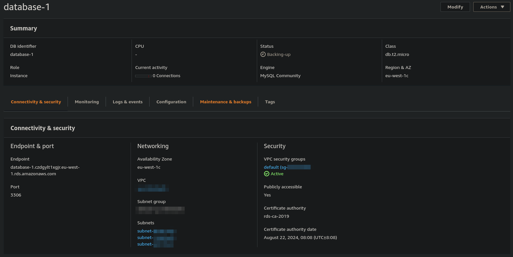

In the next tab we can see monitoring

There are also several actions we can take:

- Create a read replica for larger read capacity
- Take a snapshot - create a backup of the database which you can spin up elsewhere.
- Restore to point in time
- Migrate snapshot - in a different region for example
- Stop
- Reboot
- Delete

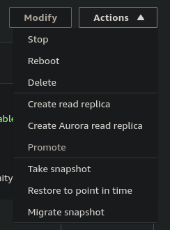
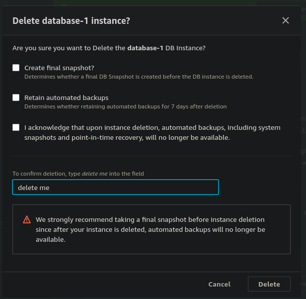