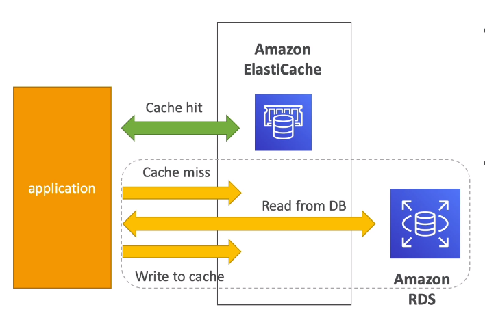
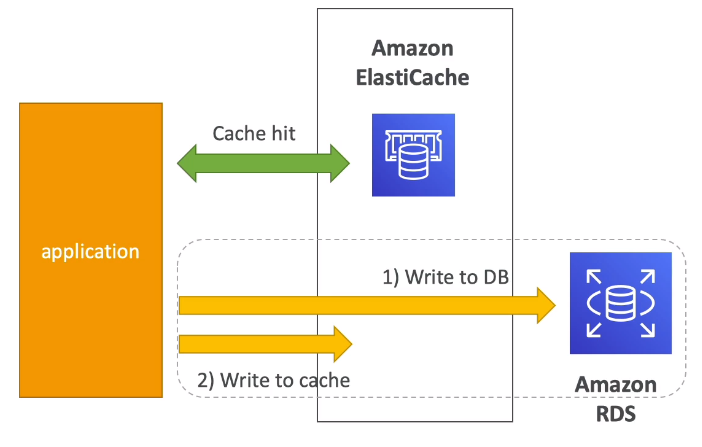

# ElastiCache Strategies

## Caching Implementation Considerations

- Read more at https://aws.amazon.com/caching/implementation-considerations/

- Is it safe to cache data?
    - Data may be out of date, eventually consistent
- Is caching effective for that data?
    - Pattern: data changing slowly, few keys are frequently needed
    - Any patterns: data changing rapidly, all larke key space frequently needed
- Is data structured well for caching?
    - Example: key value caching or caching of agggregations results

- Which caching design is the most appropriate?

## Lazy Loading / Cache-Aside / Lazy Population



- Pros
    - Only requested data is cached (the cache isn't filled up with unused data)
    - Node failures are not fatal (just increased latency to warm the cache)
- Cons
    - Cache miss penalty that results in 3 round trips, noticeable delay for that request
    - Stale data: data can be updated in the database and outdated in the cache

```python
def get_user(user_id):
    # check the cache
    record = cache.get(user_id)

    if record is None:
        # run a DB query
        record = db.query("select * from users where id = ?", user_id)
        # populate the cache
        cache.set(user_id, record)
    else:
            return record

user = get_user(17)
```

## Write Through - Add or Update cache when database is updated

- Pros:
    - Data in cache is never stale, reads are quick
    - Write penalty vs read penalty (each write requires 2 calls)
- Cons:
    - Missing data until it is added / updated in the DB. mitigation is to implement lazy loading strategy as well.
    - Cache churn - a lot of the data will never be read



```python
def save_user(user_id, values):
    # save to db
    record = db.query("update users ... where id = ?", user_id, values)
    # push into cache
    cache.set(user_id, record)

user = save_user(17, {"name": "Some name"})
```

## Cache Evictions and Time-to-live (TTL)

- Cache eviction can occur in three ways:
    - You delete the item explicitly in the cache
    - Item is evicted because the memory is full and it's not recently used (LRU)
    - You set an item time-to-live (TTL)
- TTL are helpful for any kind of data:
    - Leaderboards
    - Comments
    - Activity streams
- TTL can range from few seconds to hours or days

- If too many evictions happen due to memory, you should scale up or out.

## Final Words

- Lazy Loading / Cache aside is easy to implement and works for many situations as a foundation, especially on the read side.
- Write-through is usually combined with Lazy Loading as targeted for the queries or workloads that benefit from this optimization
- Setting a TTL is usually not a bad idea, except when you're using Write-through. Set it to a sensible value for your application
- Only cache the data that makes sense (user profiles, blogs, etc)

Quote: there are only two hard things in Computer Science: cache invalidation and naming things.