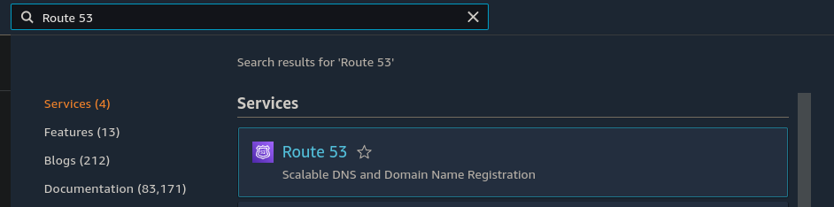
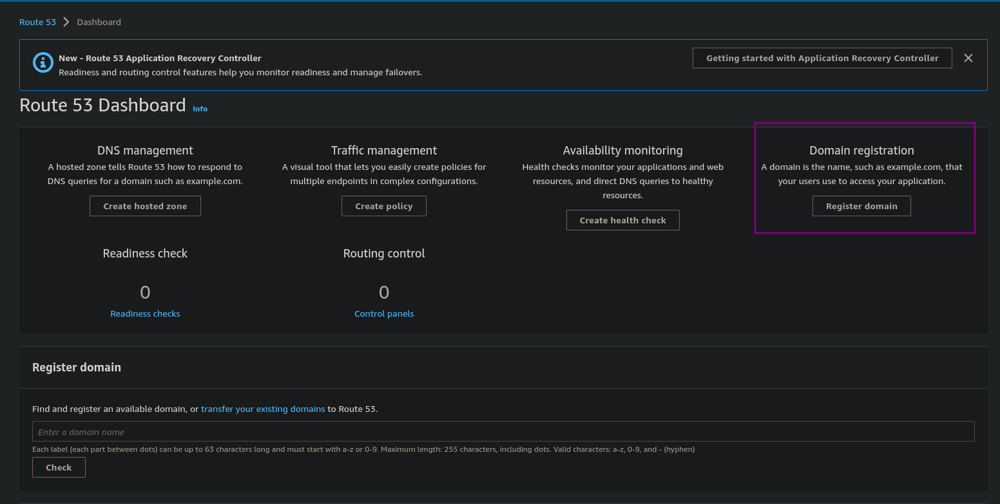
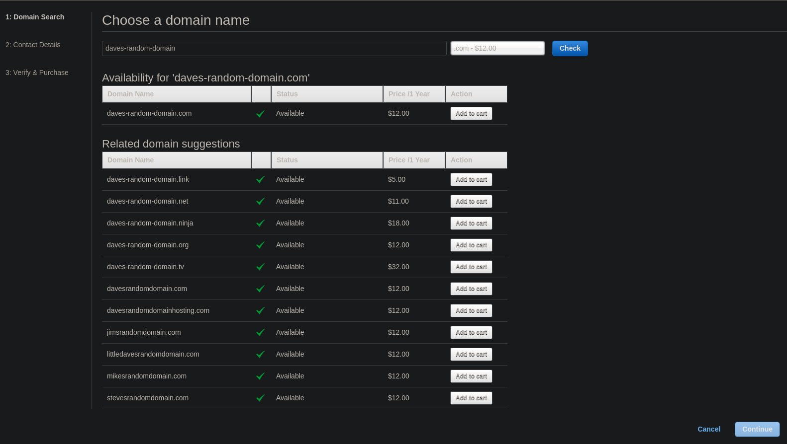
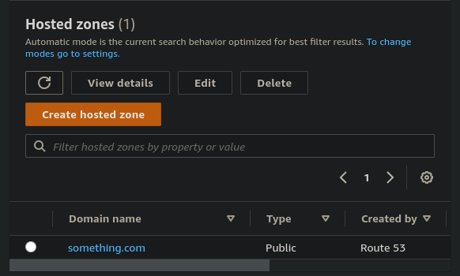
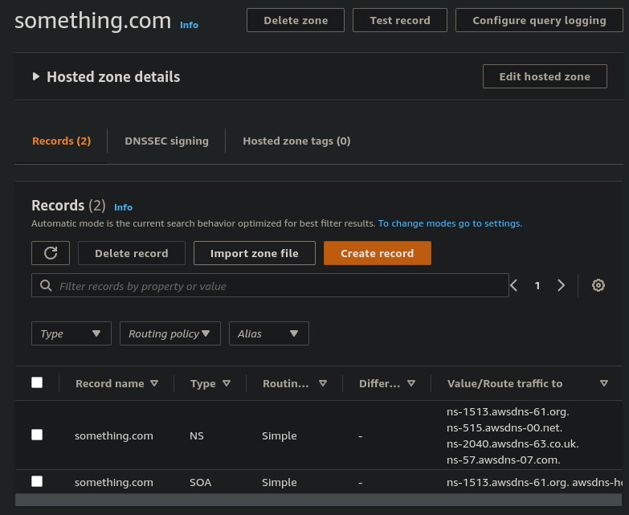

# Registering a domain

- Open Route 53 service in AWS console

- Select register domain

- Search for a domain

- Place it in the cart
- Fill in the contact details
- Verify purchase

---

Once you have made the purchase you should see a public hosted zone created in the `Hosted Zones` section as well where you can manage the DNS records for it.

