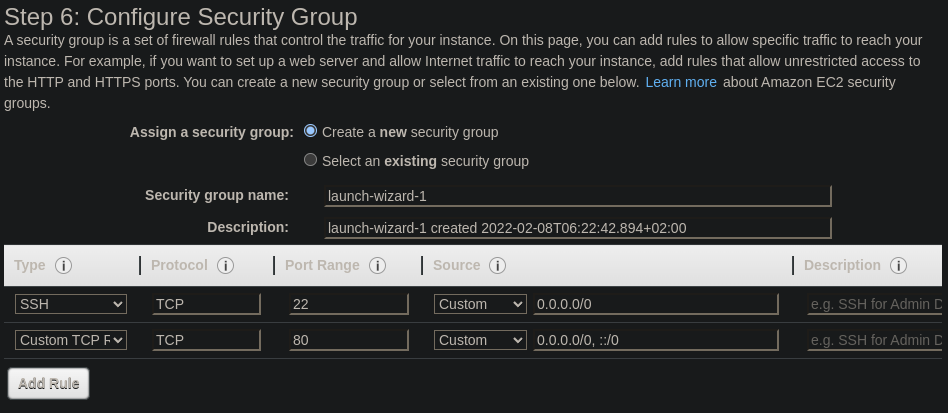

# EC2 Setup

We are going into EC2 and create 3 EC2 instances around the world with 3 different public IPs.

Same as before. Go to the EC2 service, launch instance. Amazon EC2, t2.micro.

The user data will be:

```
#!/bin/bash
yum update -y
yum install -y httpd
systemctl start httpd
systemctl enable httpd
EC2_AVAIL_ZONE=$(curl -s http://169.254.169.254/latest/meta-data/placement/availability-zone)
echo "<h1>Hello World from $(hostname -f) in AZ $EC2_AVAIL_ZONE </h1>" > /var/www/html/index.html
```

Everything else will be default except for security group.

We are going to enable both ssh and http.



We can do the same for 2 different regions as well.

Once it's done we can create an Application Load Balancer, target the instances.