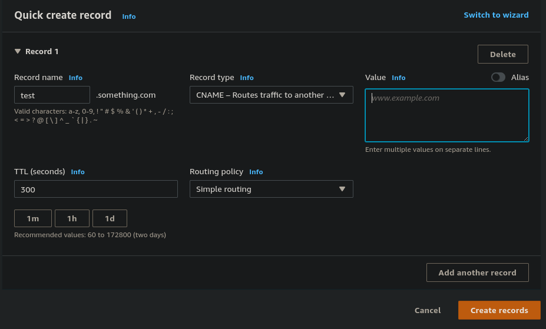
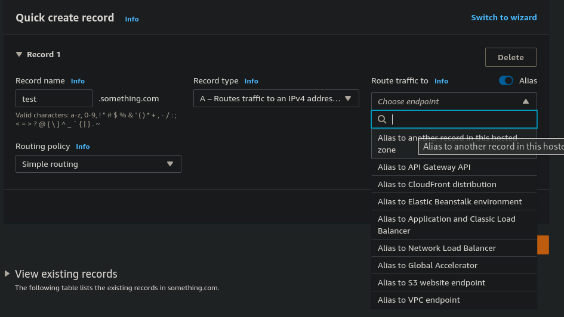

# Route 53 - CNAME vs Alias

- AWS Resources (Load Balancer, CloudFront...) expose an AWS hostname:
    - lb1-1234.us-east-2.elb.amazonaws.com and you want myapp.mydomain.com

- CNAME:
    - Points to a hostname to any other hostname (app.mydomain.com => test.anything.com)
    - **Only for non root domains (aka something.mydomain.com)**
- Alias:
    - Points a hostname to an AWS Resource (app.mydomain.com => test.mydomain.com)
    - **Works for root domain and non root domains (aka mydomain.com)**
    - Free of charge
    - Native health checks

## Route 53 - Alias Records

- Maps a hostname to an AWS Resource
- An extension to DNS functionality
- Automatically recognizes changes in the resource's IP address
- Unlike CNAME, it can be used for the top node of a DNS namespace (Zone Apex), e.g. example.com
- Alias Record is alwayts of type A/AAAA for AWS resources (IPv4 / IPv6)
- Cannot set TTL, it's set automatically by route 53

## Route 53 - Alias Record Targets

- Elastic Load Balancers
- CloudFront Distributions
- API Gateway
- Elastic Beanstalk environments
- S3 Websites
- VPC Intergace Endpoints
- Global Accelerator
- Route 53 record in the same hosted zone

- You cannot set an ALIAS record for an EC2 DNS name

