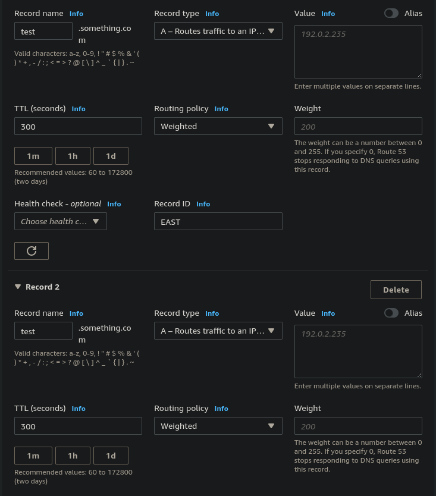

# Route 53 - Routing Policies - Weighted

- Control the % of the requests that go to each specific resource
- Assign each record a relative weight:
    - traffic (%) = (weight for a specific record) / (sum of all weights)
    - Weights don't need to sum up to 100
- DNS records must have the same name and type
- Can be associated with health checks
- Use cases: load balancing between regions, testing new application versions...
- Assign a weight of 0 to a record to stop sending traffic to that resource
- If all records have weight of 0 then all records will be returned equally

