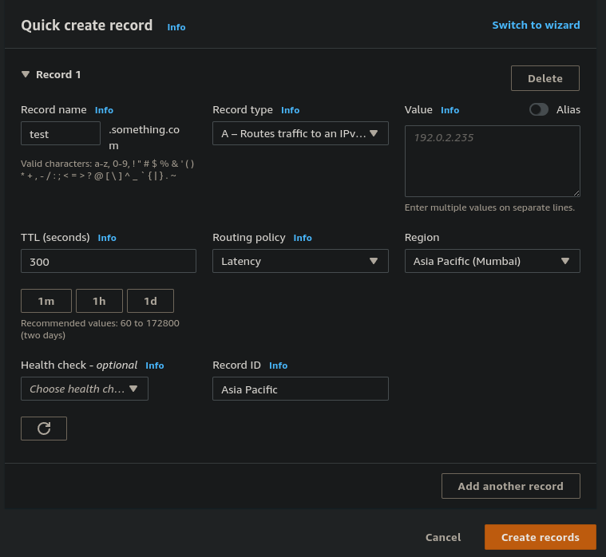

# Route 53 - Routing Policies - Latency based

- Redirect to the resource that has the least latency close to us
- Super helpful when latency for users is a priority
- Latency is based on traffic between users and AWS regions
- Germany users may be directed to the US (if that's the lowest latency)
- Can be associated with Health Checks (has a failover capability)

