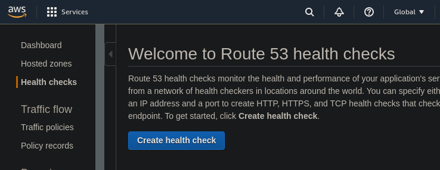
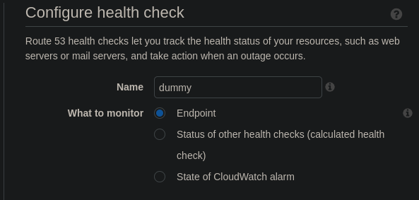
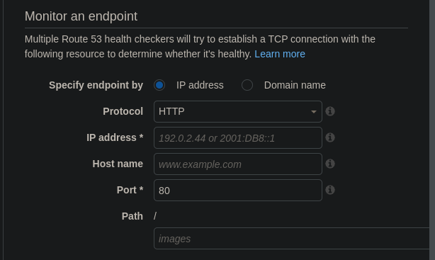
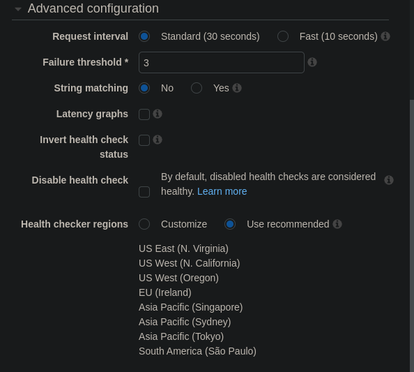
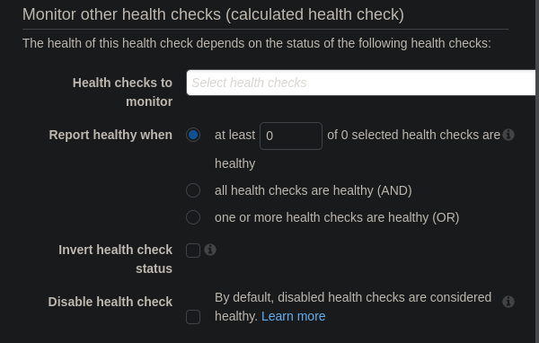
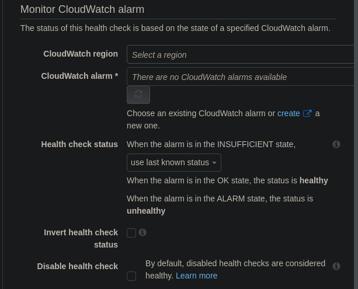

# Health Checks Hands On

We can go to the health checks section of route 53.

First we can set a name and type of the health check

For the endpoint type we have following options:

And some advanced configuration as well.

For the calculated health checks:

For the cloudwatch alarms

The second step will ask us to create alarm that will notify us each time it's unhealthy.