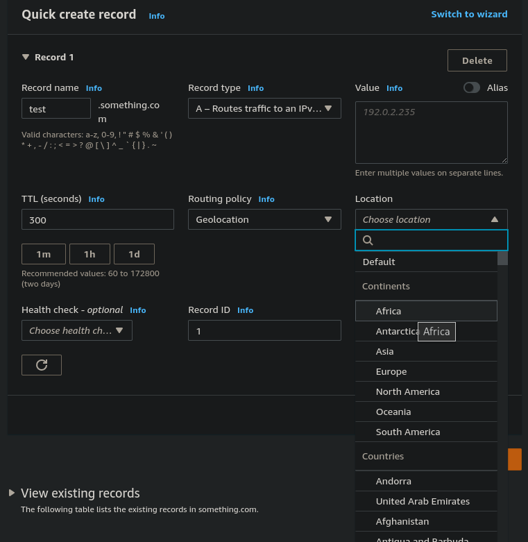

# Route 53 - Routing Policies - Geolocation

- Different from Latency-based!
- This routing is based on user location
- Specify location by Continent, Country or by US State (if there's overlapping, most precise location is selected)
- Should create a Default record (in case there's no match on location)
- Use cases: website localization, restrict content distribution, load balancing..
- Can be associated with health checks

