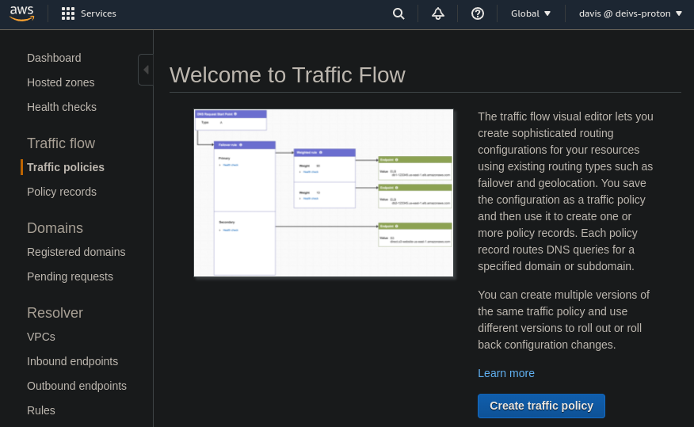
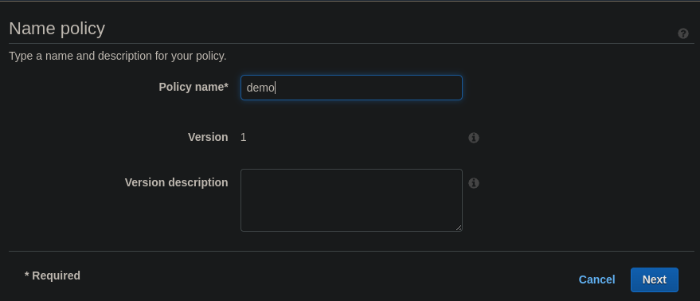
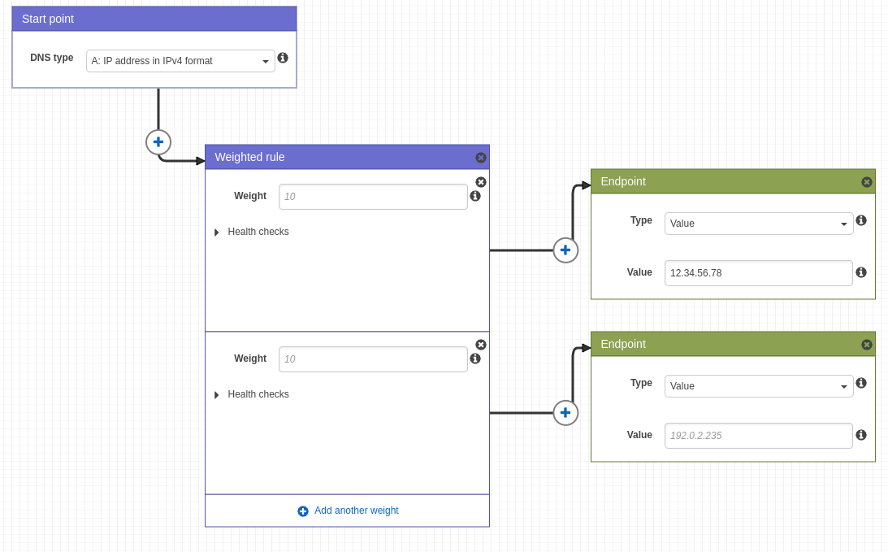
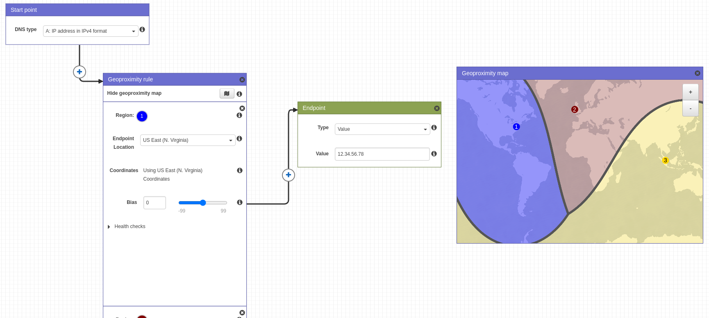
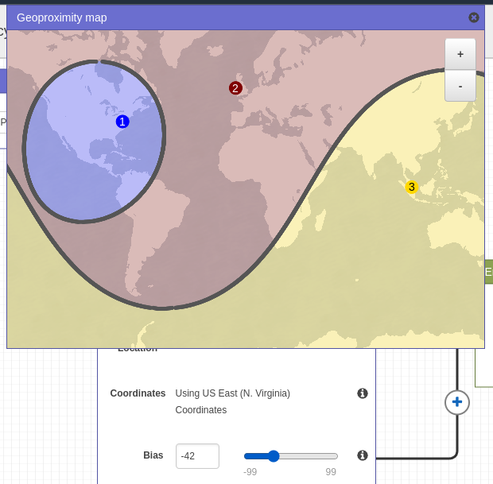

# Route 53 - Traffic Flow

- Simplify the process of creating and maintaining records in large and complex configurations
- Visual editor to manage complex routing decision trees
- Configurations can be saved as Traffic Flow Policy
    - Can be applied to different route 53 hosted zones (different domain names)
    - Supports versioning

When changing biases:

