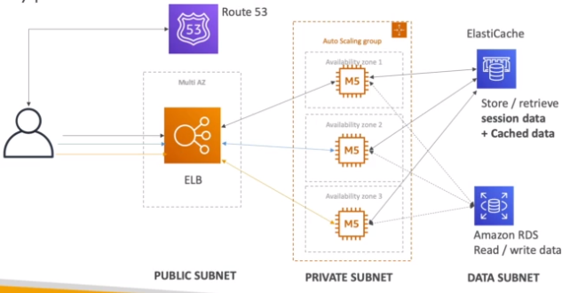
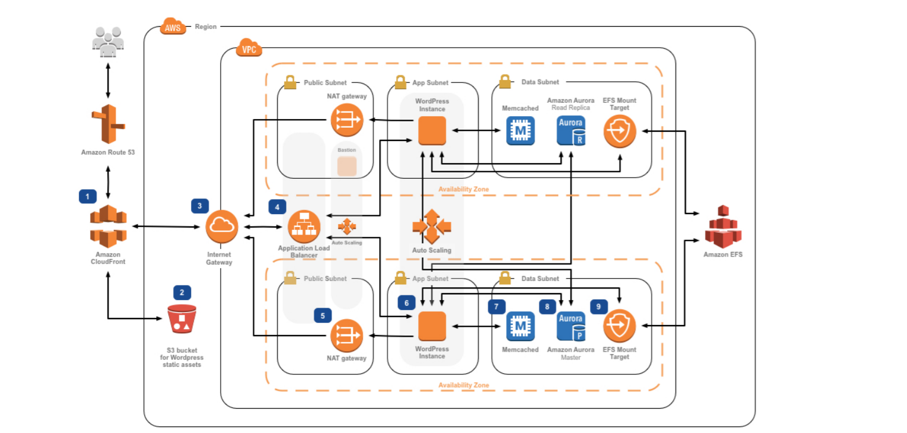

# Three Tier Architecture

## LAMP Stack on EC2

- Linux: OS for EC2 Instances
- Apache: Web Server that runs on Linux (EC2)
- MySQL: database on RDS
- PHP: Application Logic (running on EC2)

---

- Can add Redis / Memcached (ElastiCache) to include caching
- To store local application data & software: EBS drive (root)

## Wordpress on AWS

## A more complicated wordpress setup

https://aws.amazon.com/blogs/architecture/wordpress-best-practices-on-aws/