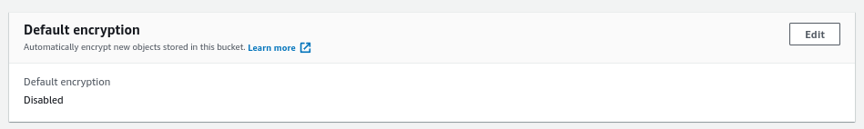
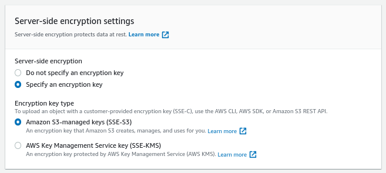
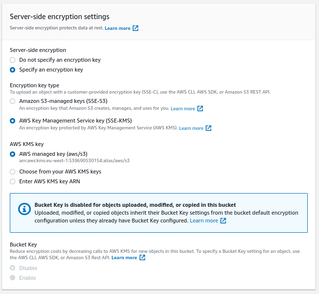
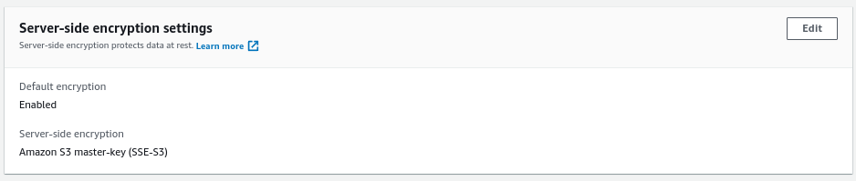
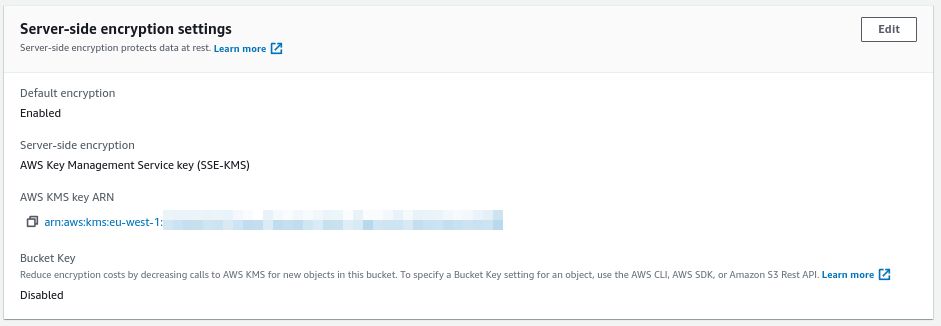
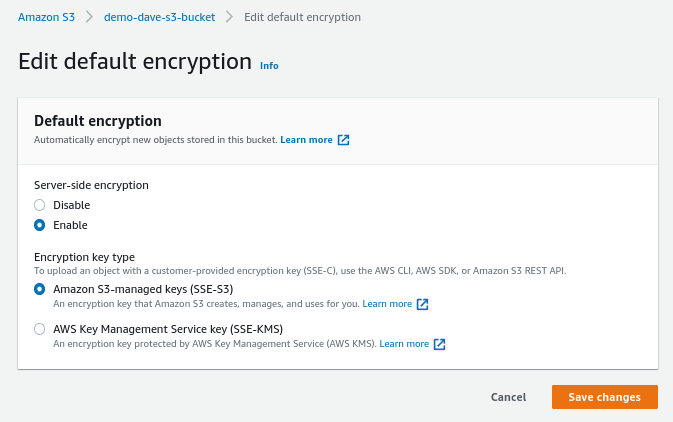
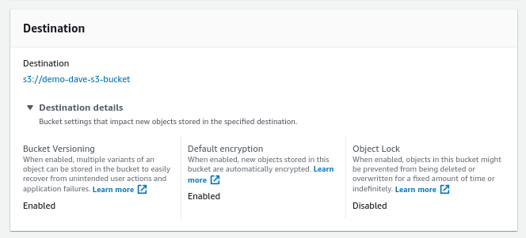
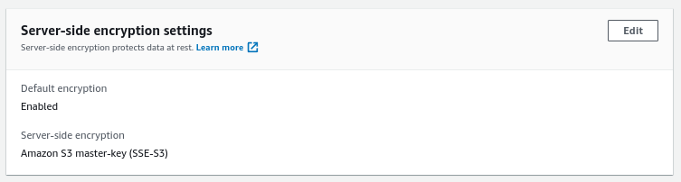

# S3 Encryption Hands On

In the bucket properties we can see a setting for encryption:

We can enable it here, but first we can upload a file and do it there:

For the KMS we have multiple options:

Once uploaded, we open up the files and see that they are encrypted:

So, we can upload files and define the enctyption settings for each of them, but we can go to the Properties and specify the default encryption mechanism for the whole bucket.

Now when we simply upload a new file to the S3:

---

Note that the other types of encryption doesn't show up because:
- SSE-C needs to be done via the CLI with a provided key
- The client side - the client needs to encrypt the file himself before uploading.

