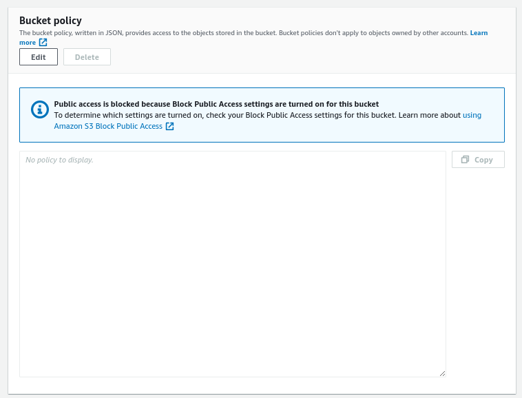
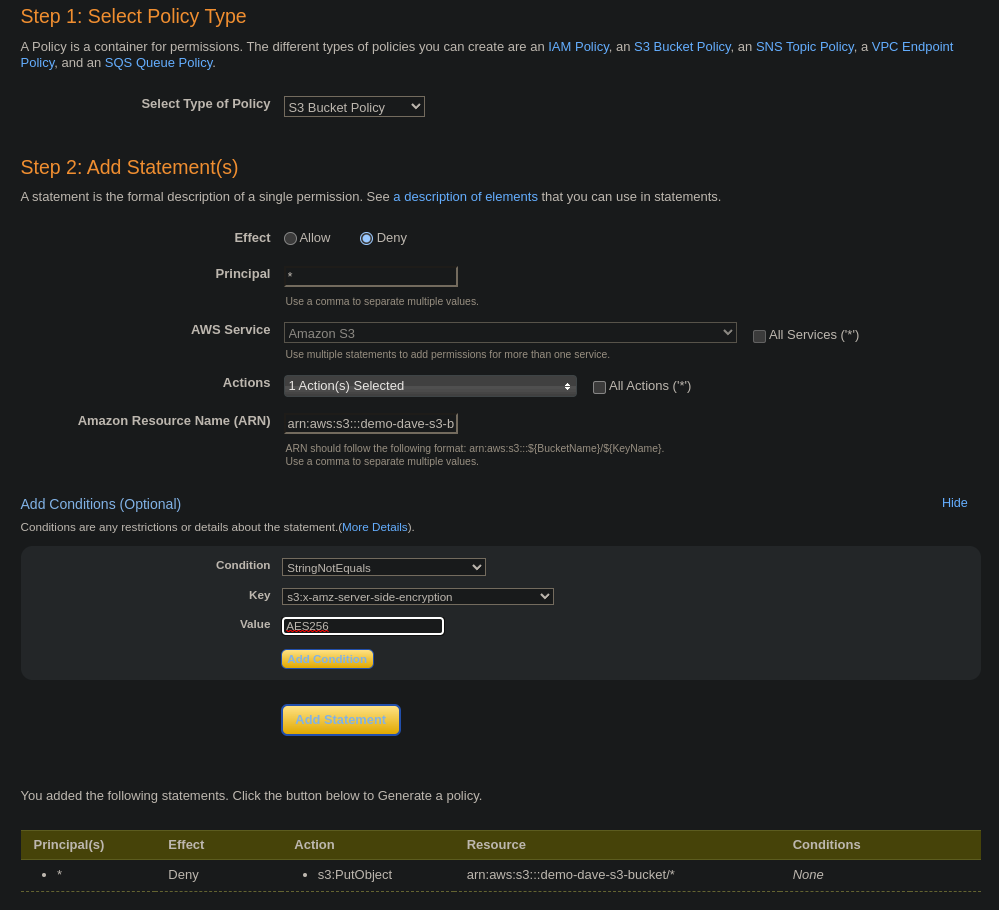
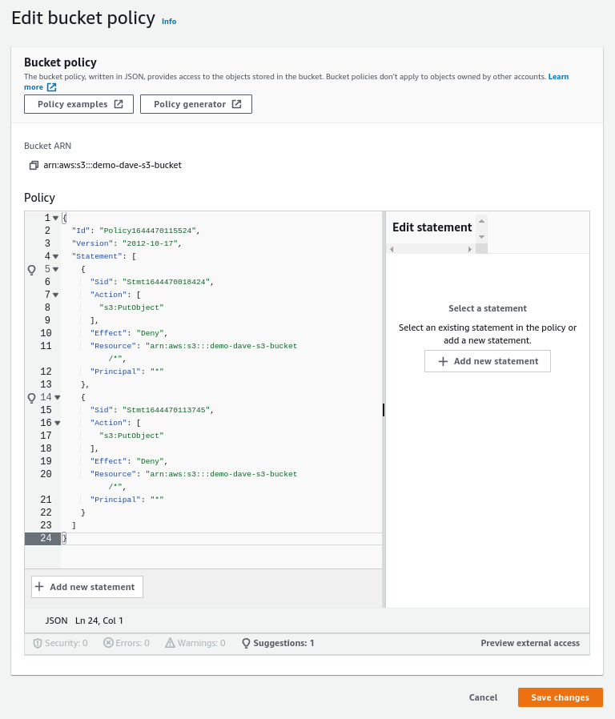
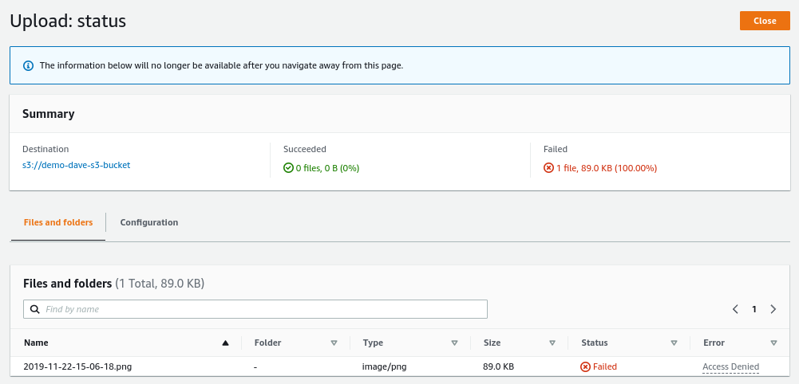
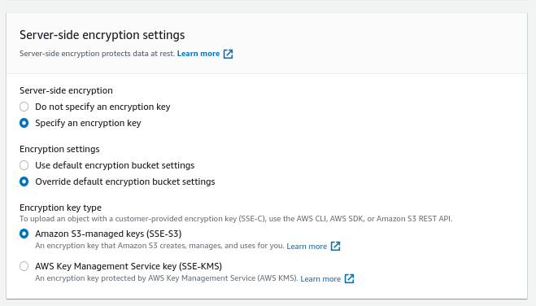
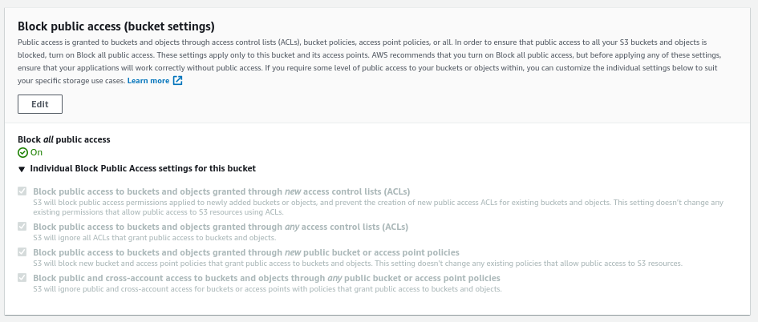
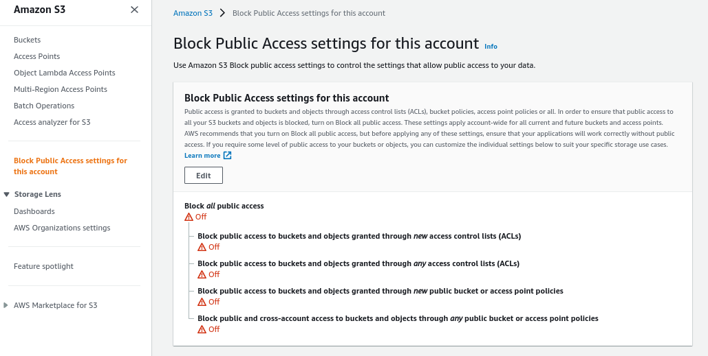
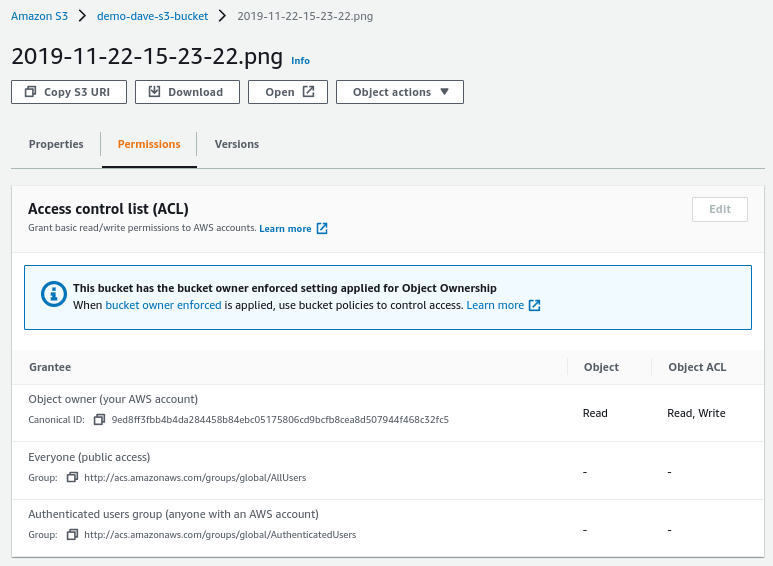

# S3 Bucket Policies Hands On

We can open up the Permissions tab in the S3 bucket and see the bucket policy settings.



We can create a policy that will prevent us from uploading files that are not encrypted.

We can see some policy examples here: https://docs.aws.amazon.com/AmazonS3/latest/userguide/example-bucket-policies.html

We can also use the policy generator: https://awspolicygen.s3.amazonaws.com/policygen.html



```json
{
  "Id": "Policy1644470115524",
  "Version": "2012-10-17",
  "Statement": [
    {
      "Sid": "Stmt1644470018424",
      "Action": [
        "s3:PutObject"
      ],
      "Effect": "Deny",
      "Resource": "arn:aws:s3:::demo-dave-s3-bucket/*",
      "Principal": "*"
    },
    {
      "Sid": "Stmt1644470113745",
      "Action": [
        "s3:PutObject"
      ],
      "Effect": "Deny",
      "Resource": "arn:aws:s3:::demo-dave-s3-bucket/*",
      "Principal": "*"
    }
  ]
}
```



Now we can try to upload an unencrypted file:



If we upload the same file, but specify the SSE-S3 encryption:




----

In the permissions tab we can see the block public access settings as well:



If we want to set it up account wide, we can go to Block Public Access settings for this account in the sidebar.



---

For all my objects we have something called ACL



Here we can define who can access (read/write) the object