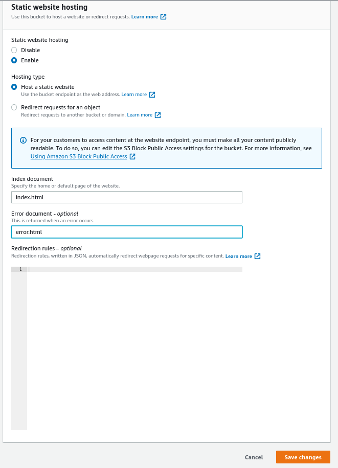
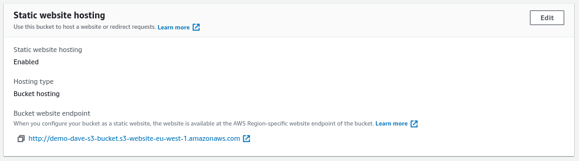
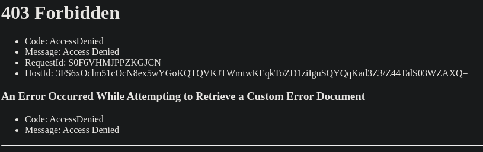
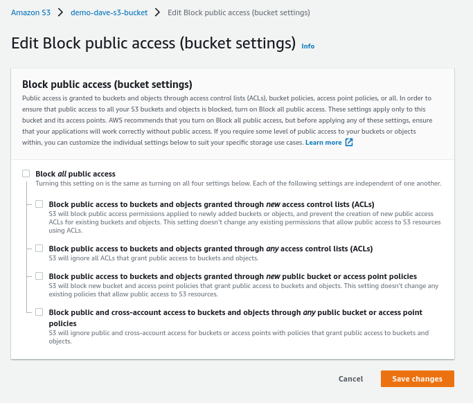
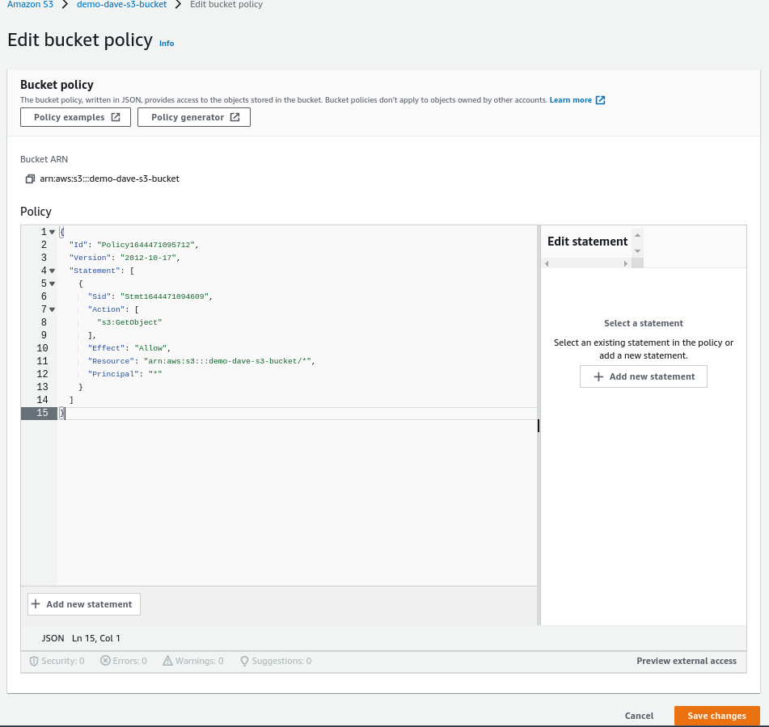
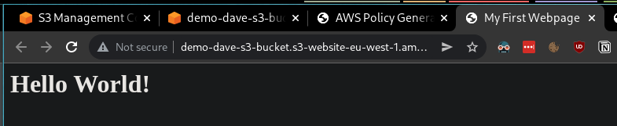
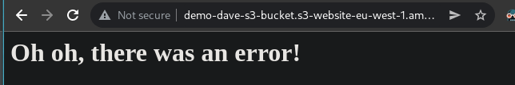

# S3 Websites

- S3 can host static websites and have them accessible on the web
- The website URL will be:
    - <bucket-name>.s3-website-<aws-region>.amazonaws.com
    OR
    - <bucket-name>.s3-website.<aws-region>.amazonaws.com


- If you get a 403 (Forbidden) error, make sure the bucket policy allows public reads!

---

We can upload a new index.html file with the following content:

```html
<html>
    <head>
        <title>My First Webpage</title>
    </head>
    <body>
        <h1>Hello World!</h1>
    </body>
</html>
```

And an error.html

```
<h1>Oh oh, there was an error!</h1>
```

Now we can go to the properties and enable static website hosting:



In the properties we will be able to view the endpoint now:



If we open it up:



This is due to the fact that the bucket is not public:



```json
{
  "Id": "Policy1644471095712",
  "Version": "2012-10-17",
  "Statement": [
    {
      "Sid": "Stmt1644471094609",
      "Action": [
        "s3:GetObject"
      ],
      "Effect": "Allow",
      "Resource": "arn:aws:s3:::demo-dave-s3-bucket/*",
      "Principal": "*"
    }
  ]
}
```



Now, if we refresh the page:



If we open up a path that doesn't exist:

