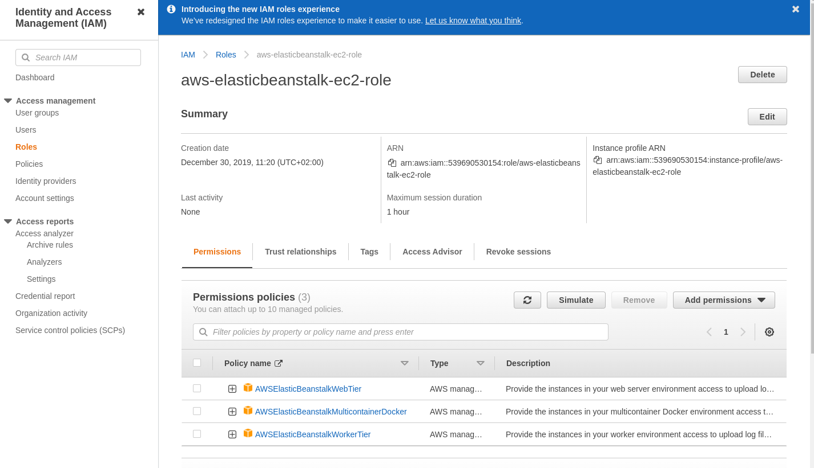
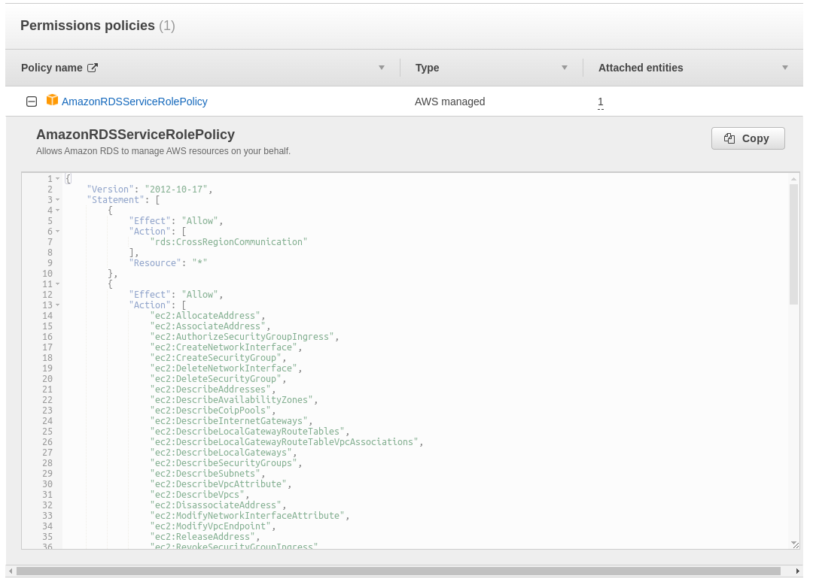
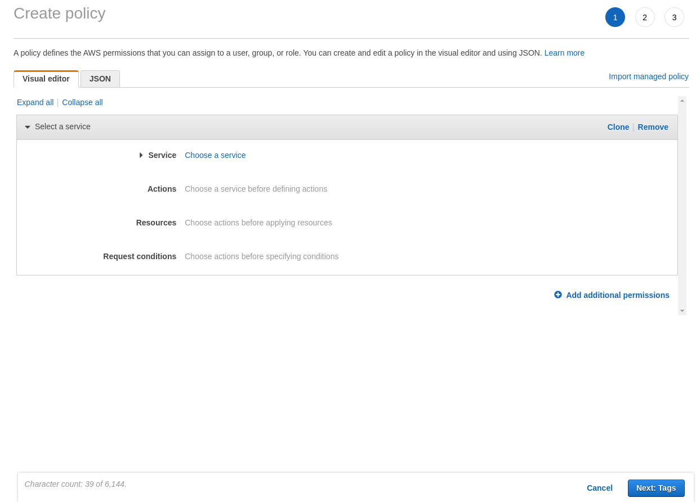
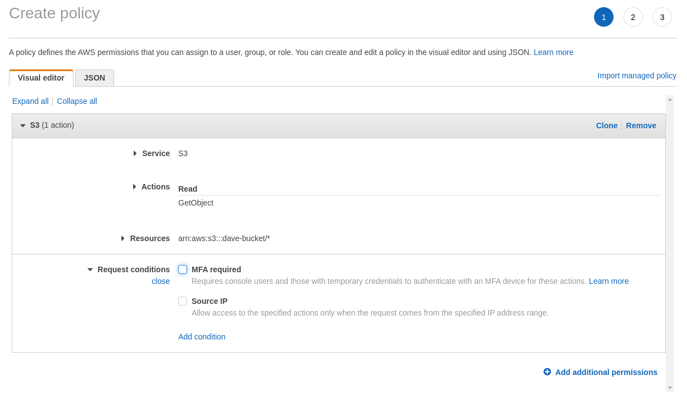
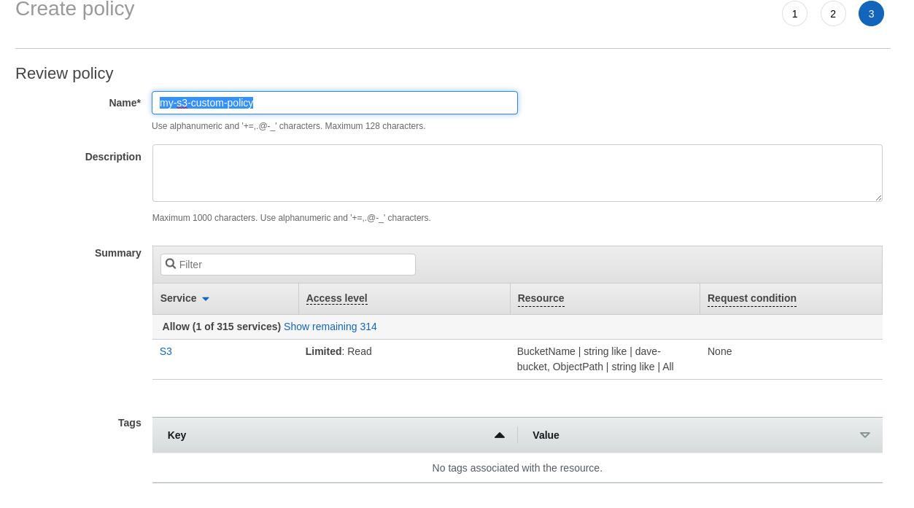
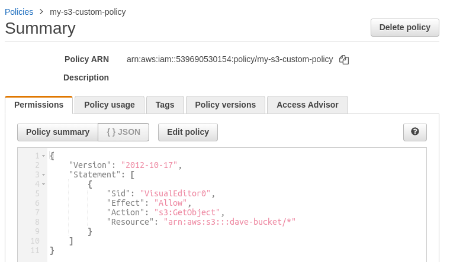
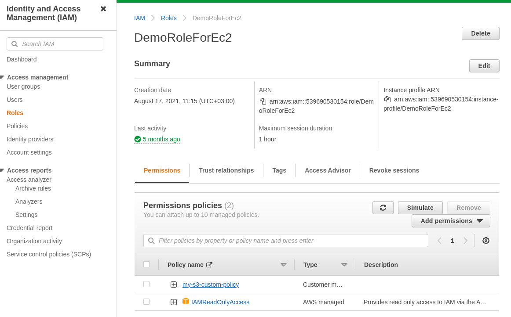

# IAM Roles and Policies Hands On

In IAM we can have roles that have policies attached to them.

These can be:
- AWS Created policies
- Inline policies (use discouraged for better management)
- Custom created policies

Each policy is a JSON Document that specifies what user is allowed and what not.

---

We can create our own policies by going to Policies and Clicking on Create Policy. Here we can use a visual editor or a JSON file.

We can create a policy to allow getting objects from a specific bucket.

Now we can give it a name

Now we can view the policy:

Now we can also attach the policy to roles:

