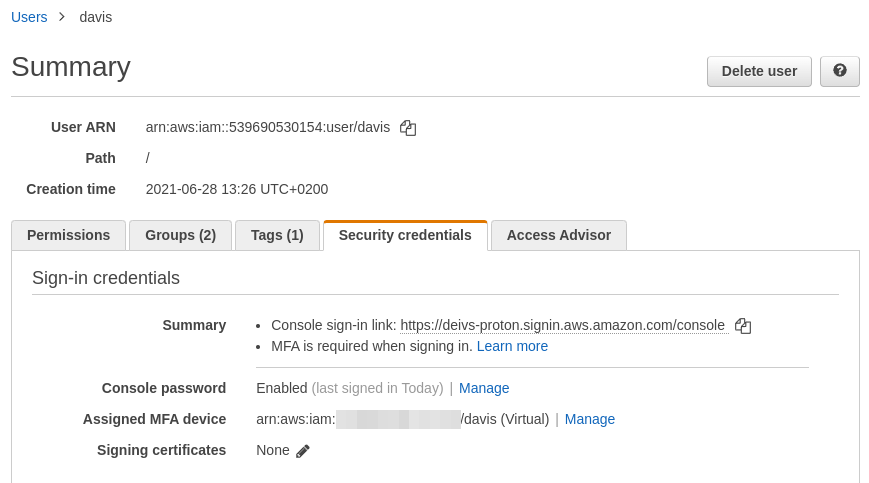

# AWS CLI with MFA

- To use MFA with the CLI, you must create a temporary session
- To do so, you must run the STS GetSessionToken API

```console
aws sts get-session-token --serial-number arn-of-the-mfa-device --token-code code-from-token --duration 3600
{
    "Credentials": {
        "SecretAccessKey": "secret-access-key",
        "SessionToken": "temporary-session-token",
        "Expiration": "expiration-date-time",
        "AccessKeyId": "access-key-id"
    }
}
```

In order to do this, you need to go to your IAM settings and assign an MFA device under the Security Credentials tab:



This Assigned MFA device is the $arn-of-the-mfa-device, the $code-from-token is the code on your MFA device.

You can add the SessionToken to your ~/.aws/credentials

```
aws_session_token = ...
```