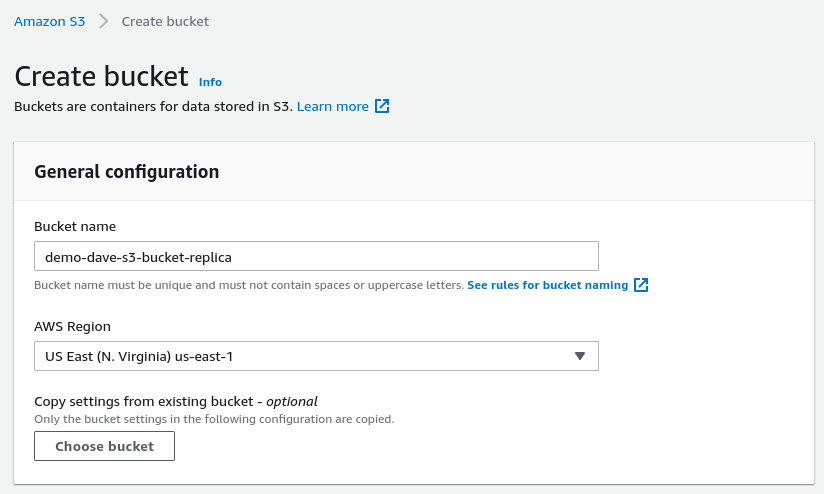
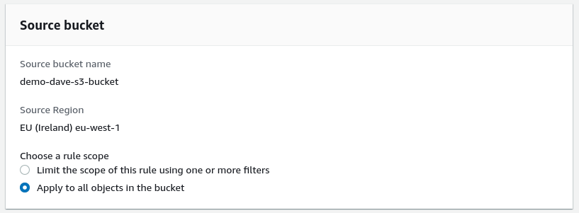
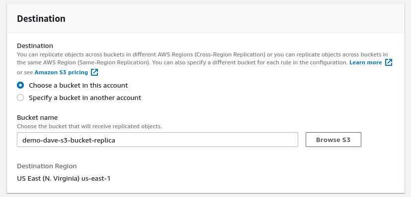
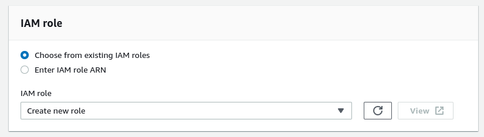
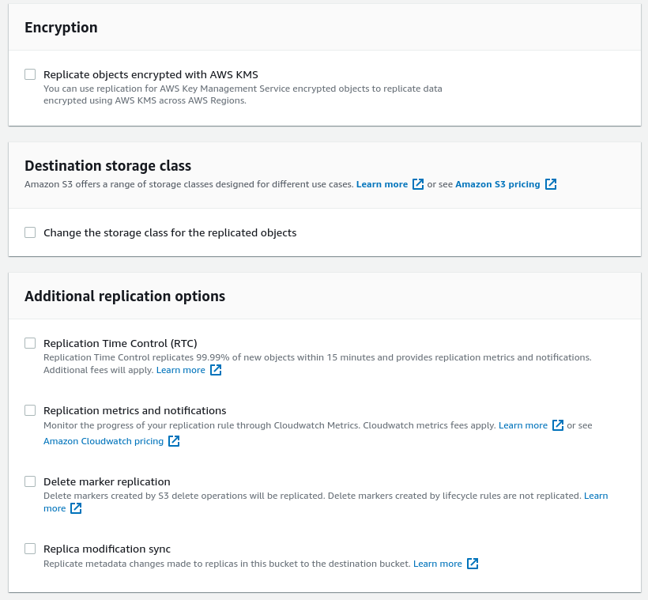
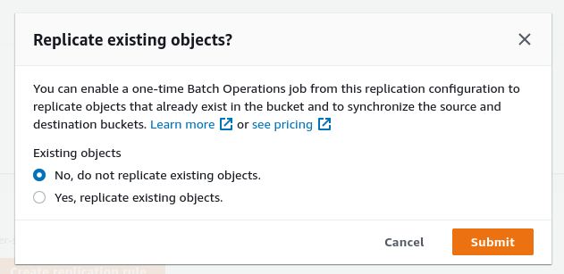
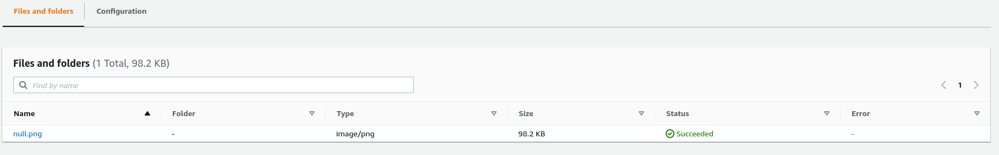
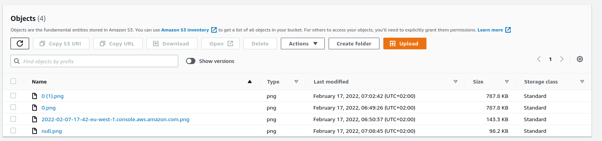

# S3 Replication Hands On

1. Make sure the versioning is turned on
2. Create a new bucket, preferably into a different region, enable the versioning for it as well.

3. Under the original bucket we can go to `Management -> Replication Rules` and add one.

Here we can either enable the scope to be some specific files or all objects in the bucket.

We can select an S3 bucket in this or another account.

Finally we need an IAM role to perform this action, we can ask AWS to create one for us.

Other options include encryption, destination storage class, and replication settings.

When creating, there is an option to replicate existing objects as well.

Now, if we upload a file into the primary bucket:

After a few seconds it should show up in the replica as well:

Note: that the deletes are not replicated across the buckets.