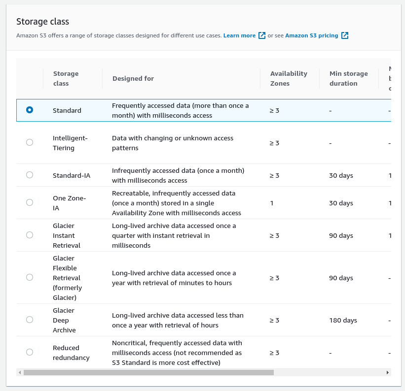
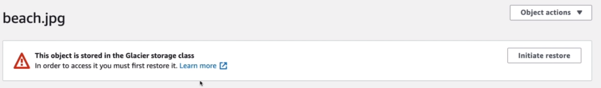
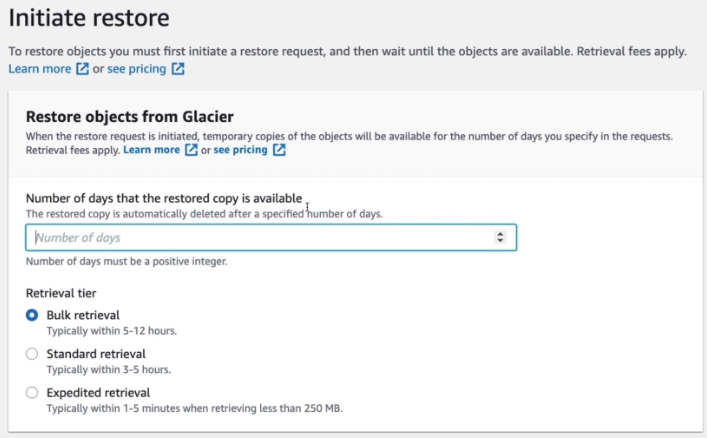

# S3 Storage Classes Hands On

When uploading a file into a bucket, we can choose the storage class for that object.

If we choose the glacier and we want to open the file, we can't - we have to restore it first.

We can initiate the restore, set for how many days the object will be kept. And choose a retrieval tier which will impact the cost.

