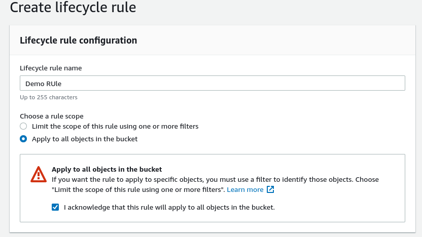
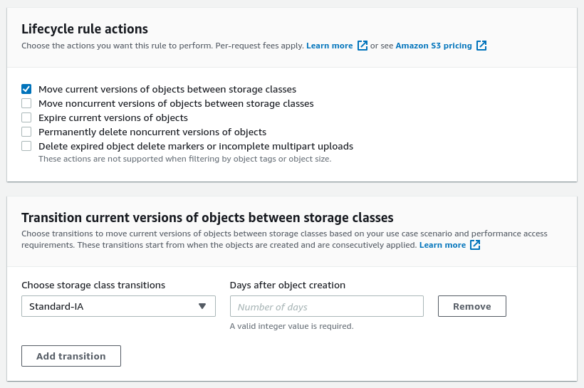
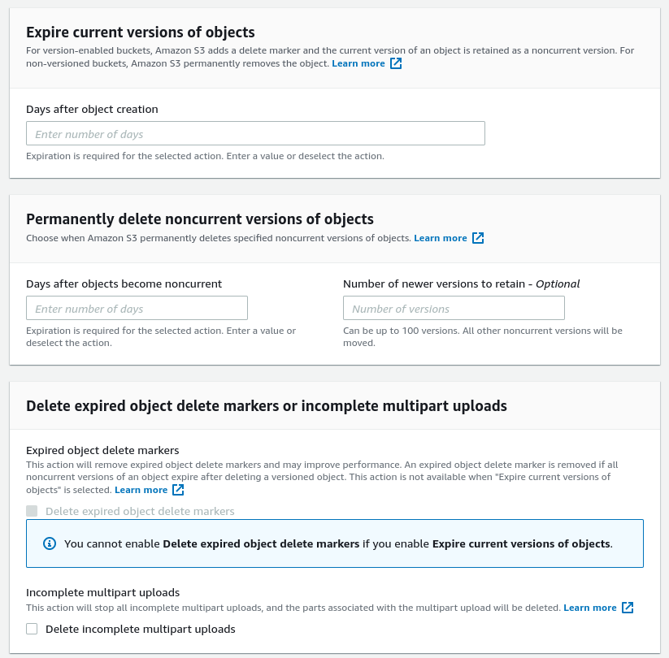

# S3 Lifecycle Rules Hands On

We can set up the lifecycle rules in `Management -> Lifecycle Rules`.
When creating a rule, we can target specific files or all the objects.

Then we can select an rule action we want, it will display options for that action.

Here are the other options as well:

