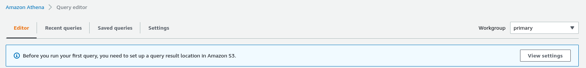
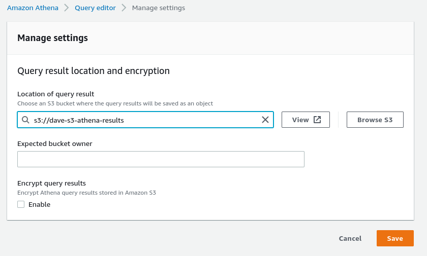
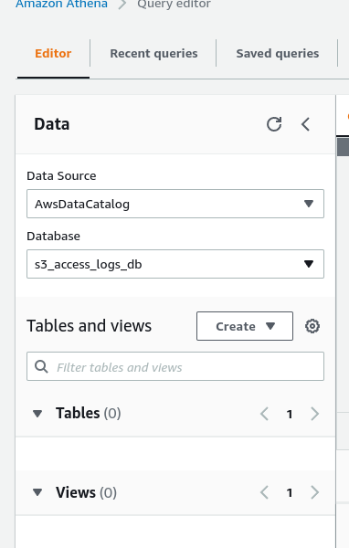
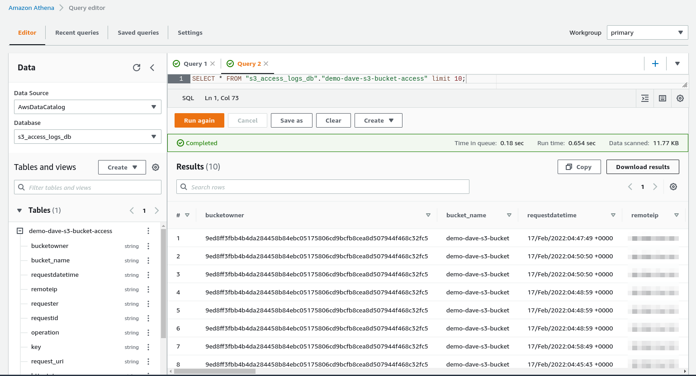

# Athena Hands On

We can open up the Athena in AWS Console and open up the query editor.
If this is the first time using it, we need to set up an S3 bucket for results.




On the left side of the query editor we can see data sources and databases we can use.



In the s3_access_logs_db we can run following queries from https://aws.amazon.com/premiumsupport/knowledge-center/analyze-logs-athena/

```sql
CREATE EXTERNAL TABLE `s3_access_logs_db.demo-dave-s3-bucket-access`(
  `bucketowner` STRING,
  `bucket_name` STRING,
  `requestdatetime` STRING,
  `remoteip` STRING,
  `requester` STRING,
  `requestid` STRING,
  `operation` STRING,
  `key` STRING,
  `request_uri` STRING,
  `httpstatus` STRING,
  `errorcode` STRING,
  `bytessent` BIGINT,
  `objectsize` BIGINT,
  `totaltime` STRING,
  `turnaroundtime` STRING,
  `referrer` STRING,
  `useragent` STRING,
  `versionid` STRING,
  `hostid` STRING,
  `sigv` STRING,
  `ciphersuite` STRING,
  `authtype` STRING,
  `endpoint` STRING,
  `tlsversion` STRING)
ROW FORMAT SERDE
  'org.apache.hadoop.hive.serde2.RegexSerDe'
WITH SERDEPROPERTIES (
  'input.regex'='([^ ]*) ([^ ]*) \\[(.*?)\\] ([^ ]*) ([^ ]*) ([^ ]*) ([^ ]*) ([^ ]*) (\"[^\"]*\"|-) (-|[0-9]*) ([^ ]*) ([^ ]*) ([^ ]*) ([^ ]*) ([^ ]*) ([^ ]*) (\"[^\"]*\"|-) ([^ ]*)(?: ([^ ]*) ([^ ]*) ([^ ]*) ([^ ]*) ([^ ]*) ([^ ]*))?.*$')
STORED AS INPUTFORMAT
  'org.apache.hadoop.mapred.TextInputFormat'
OUTPUTFORMAT
  'org.apache.hadoop.hive.ql.io.HiveIgnoreKeyTextOutputFormat'
LOCATION
  's3://demo-dave-s3-bucket-access/s3-logs/'
```

Now we'll be able to see the table on the left side and preview it:

```sql
SELECT * FROM "s3_access_logs_db"."demo-dave-s3-bucket-access" limit 10;
```

