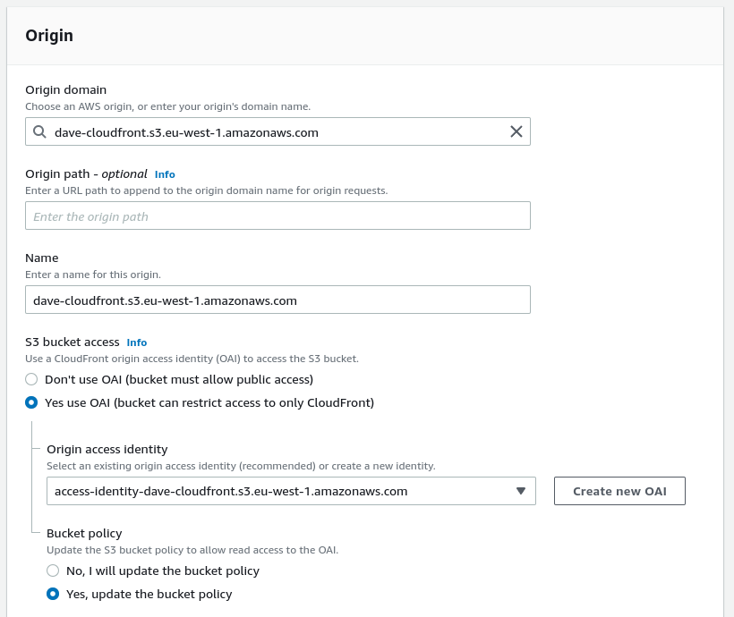
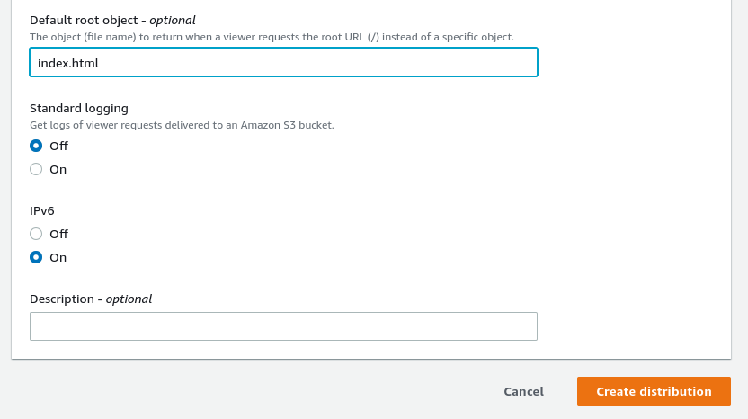
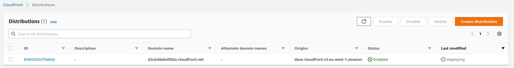
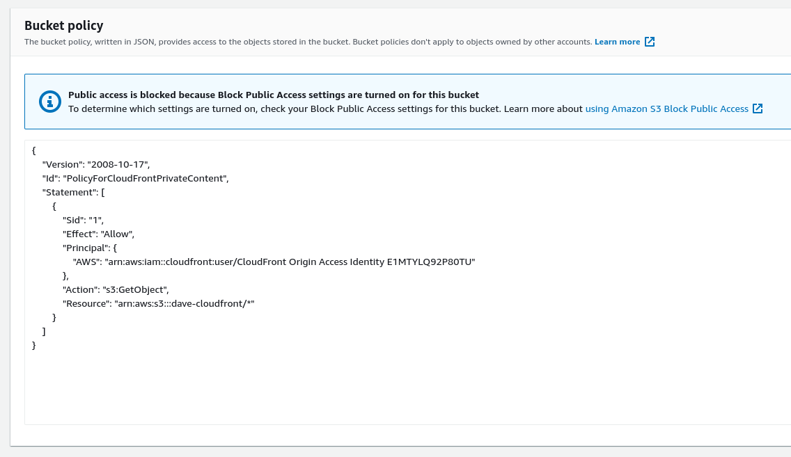
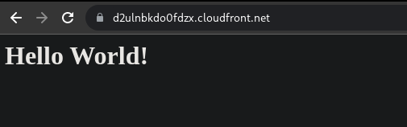

# CloudFront Hands On

Before working with CloudFront we need to create an S3 Bucket.
There we can upload an index.html file and some pictures.

Then navigate to cloudfront on AWS Console, create a new distribution.

We are going to set up the origin as the S3 bucket we created, and set an origin access identity that the cloudfront will use to access the s3 bucket.

Then, we'll set up the default root object as index.html

Once we have created the cloudfront application, it will take about 5 minutes to deploy.

We can also see that the distribution changed the bucket policy.

Once the deployment has been done - we can open it up.

