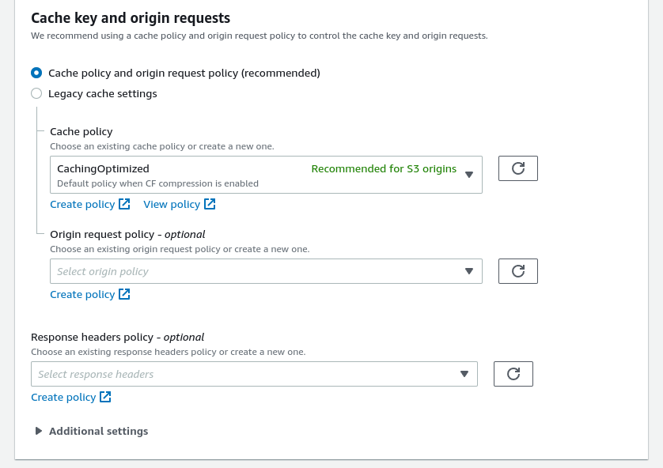
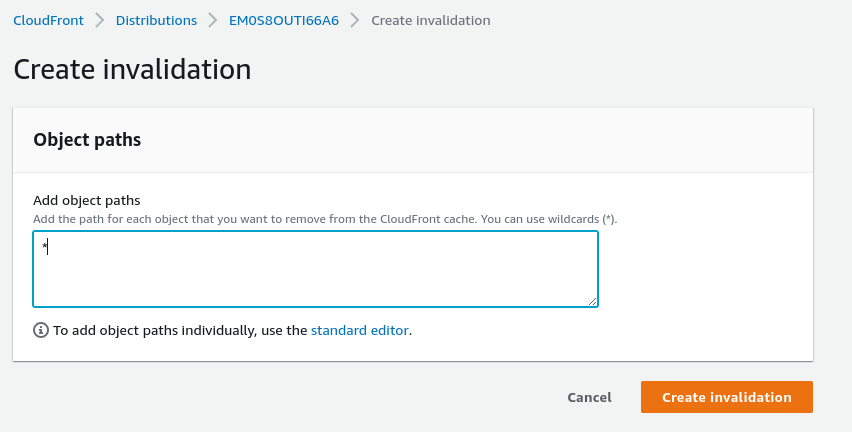

# CloudFront Caching And Invalidations Hands On

We can open up the cloudfront distribution, open the behaviours tab, select the first result and edit it.

There will be settings for cache.

We can choose a policy there or create a new one.

---

As for the invalidations. We can open up the Invalidations tab and create a new invalidation.

