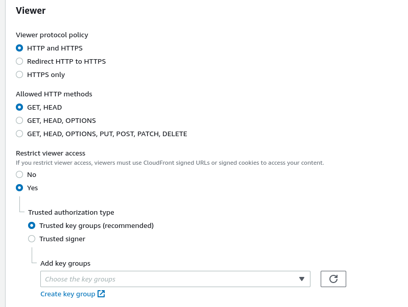
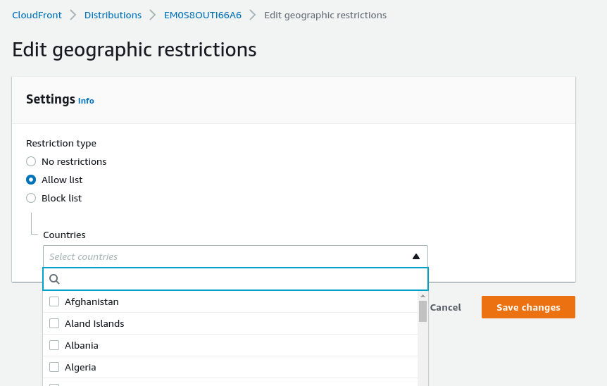

# CloudFront Security

## CloudFront Geo Restriction

- You can restrict who can access your distribution
    - Whitelist: allow users from specific countries
    - Blacklist: Deny users from specific countries

- Country determined using a 3rd party geo-ip database
- Use case: copyright laws to control access to content

## CloudFront and HTTPS

- Viewer Protocol Policy:
    - Redirect HTTP to HTTPS
    - Or use HTTPS only
- Origin Protocol Policy (HTTP to S3)
    - HTTPS only
    - Or Match viewer (HTTP => HTTP, HTTPS => HTTPS)

Note: s3 bucket websites dont support https

---

This can be configured under behaviour.

--- 

For the geographic restrictions we can choose the `Geographic restrictions` tab.

