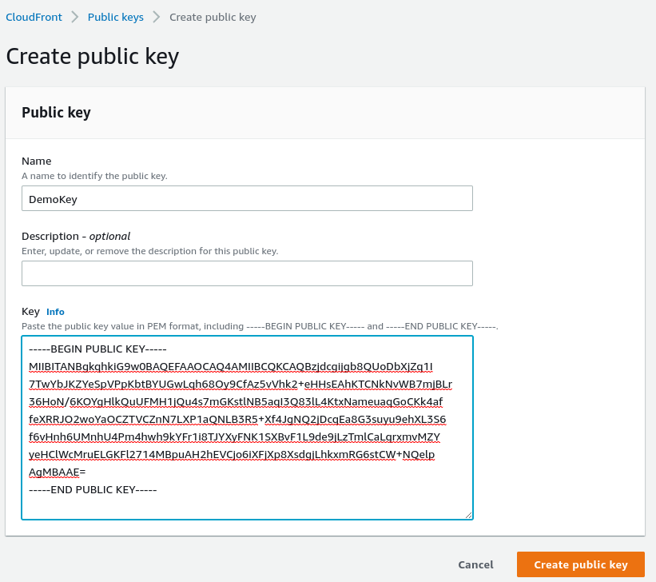
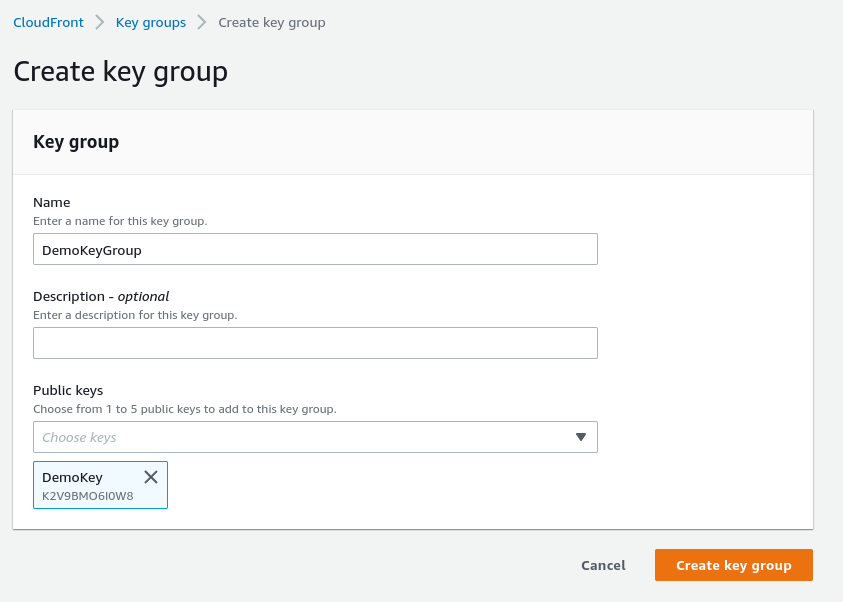
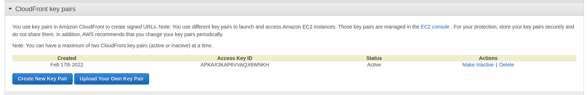

# CloudFront Signed URL - Key Groups + Hands On

## CloudFront Signed URL Process

- Two types of signers:
    - Either a trusted key group (recommended)
        - Can leverage APIs to create and rotate keys (and IAM for API Security)
    - An AWS account that contains a CloudFront Key Pair
        - Need to manage keys using the root account and the AWS Console
        - Not recommended because you shouldn't use the root account for this.
- In your CloudFront distribution, create one or more trusted key groups
- You generate your own public / private key
    - The private key is used by your applications (e.g. EC2) to sign URLs
    - The public key (uploaded) is used by CloudFront to verify URLs

---

To add the key first we generate a RSA 2048 bit key, the private one we keep to ourselves, the public one we add to the `CloudFront -> Public Keys`.

Then we can create a key group.

You can also create the keypairs using the unrecommended way - log into the root account and go to security credentials.

