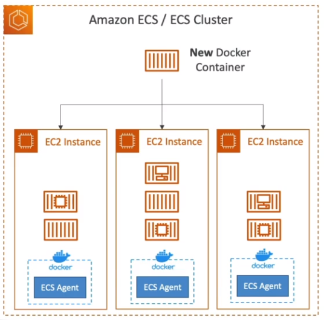
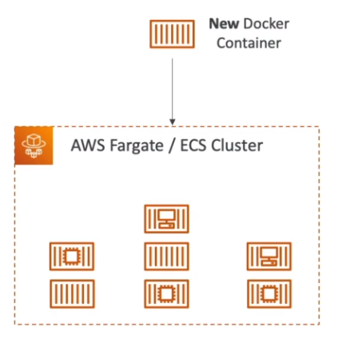
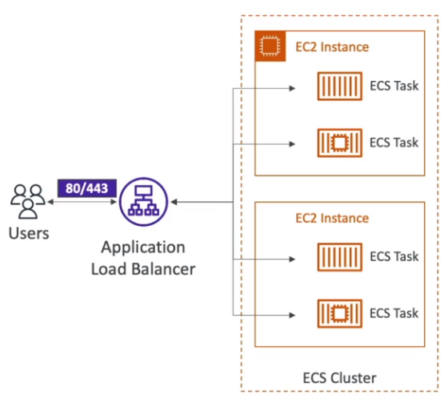

# Amazon ECS

## EC2 Launch Type

- ECS stands for Elastic Container Service
- When you launch an docker containers on AWS - launch ECS Tasks on ECS Clusters
- EC2 Launch Type: you must provision & maintain the infrastructure (the EC2 instances)
- Each EC2 instance must run the ECS agent to register in the ECS cluster
- AWS takes care of starting / stopping the containers

## Fargate Launch Type

- Launch Docker containers on AWS
- You do not provision the infrastructure (no EC2 instances to manage)
- It's all serverless
- You just creeate task definitions
- AWS just runs ECS tasks for you based on the CPU/RAM you need

## IAM Roles for ECS

- EC2 Instance Profile (EC2 Launch Profile Only)
    - Used by the ECS agent
    - Makes API calls to ECS service
    - Send container logs to CloudWatch Logs
    - Pull Docker image from ECR
    - Reference sensitive data in Secrets Manager or SSM Parameter Store
- ECS Task Role
    - Allows each task to have a specific role
    - Use different roles for the different ECS Services you run
    - Task role is defined in the task definition

## Load Balancer Integrations

- Application Load Balancer - supported and works for most use cases.
- Network Load Balancer - recommended only for high throughput / high performance use cases, or to pair it with AWS Private Link
- Elastic Load balancer - supported but not recommended (no advanced features - no Fargate).

## Data Volumes (EFS)

- Mount EFS file systems onto ECS tasks
- Works for both EC2 and Fargate launch types
- Tasks running in any AZ will share the same data in the EFS file system
- Fargate + EFS = serverless
- Use cases: persistent multi-AZ shared storeage for containers
- Note:
    - FSx for Lustre & Windows not supported
    - Amazon S3 cannot be mounted as a file system