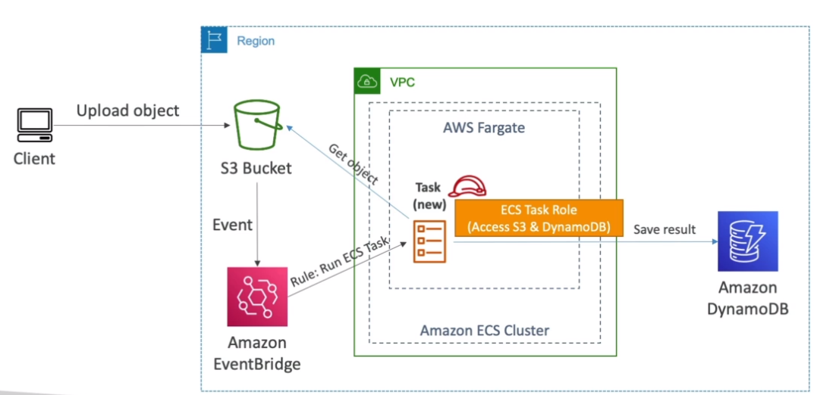
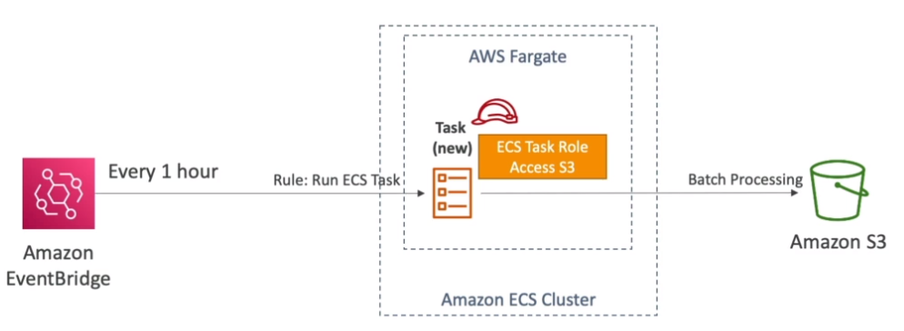
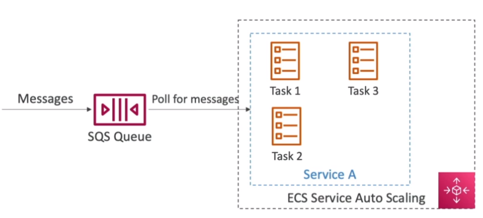

# ECS Solutions Architectures

## ECS Tasks invoked by Event Bridge

We can have a scenario where an EventBridge event is fired that spins up an AWS Fargate task, which essentially is serverless.

## ECS Tasks invoked by Event Bridge Schedule

We can also schedule tasks

## ECS - SQS Queue

We can have tasks that are polling SQS queue and uses autoscaling so that the more messages we have, the more tasks we will deploy.

