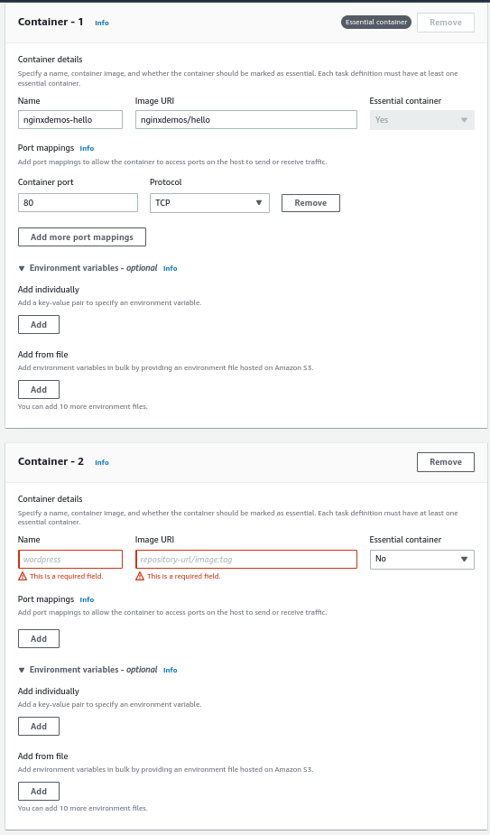
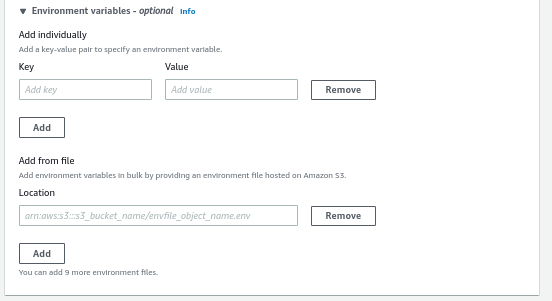

# Task Definitions - Hands On

In the task definition we can define multiple containers.

We can also define whether it's essential or not. It means whether the task can continue running with the container being stopped.

For each container we can provide environment variables by defining them individually or by providing a file.

Currently via the console you cannot specify to use Parameter Store or Secrets Manager, but you can do it via the older version of the console, JSON format or CloudFormation.