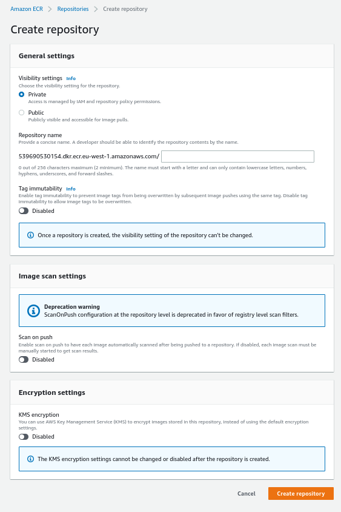

# Amazon ECR

## Using AWS CLI

- Login Command via AWS CLI v2

```console
aws ecr get-login-password --region region | docker login --username AWS --pasword-stdin aws_account_id.dkr.ecr.region.amazonaws.com
```

- Push

```console
docker push aws_account_id.dkr.ecr.region.amazonaws.com/demo:latest
```

- Pull

```
docker pull aws_account_id.dkr.ecr.region.amazonaws.com/demo:latest
```

- In case an EC2 instance (or you) can't pull a docker image, check IAM permissions.


---

To create a repository we can go to Amazon ECR in the console and click on create a repository.

There we have multilple options like having the repository private or public, it's name.

We can also have features like:
- Tag immutability (prevents image tags from being overwritten)
- Automatic image scans for vulnerabilities
- KMS encryption



Once it's created we we can do the following things

```console
$ aws ecr get-login-password --region eu-west-1 | docker login --username AWS --pasword-stdin {account_id}.dkr.ecr.eu-west-1.amazonaws.com
$ docker build -t {reponame} .
$ docker tag {reponame}:latest {account_id}.dkr.ecr.eu-west-1.amazonaws.com/{reponame}:latest
$ docker push {account_id}.dkr.ecr.eu-west-1.amazonaws.com/{reponame}:latest
```