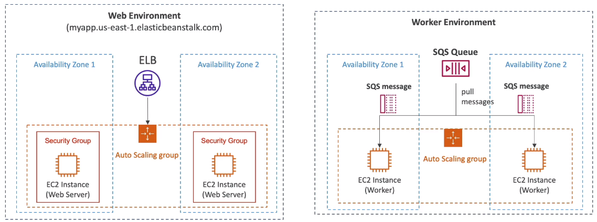

# Elastic Beanstalk Overview

- Developer problems on AWS
    - Managing infrastructure
    - Deploying Code
    - Configuring all the databases, load balancers etc
    - Scaling concerns

- Most web apps have the same architecture (ALB+ASG)
- All the developers want is for their code to run!
- Possibly, consistently across different applications and environments

## Elastic Beanstalk

- Elastic Beanstalk is a developer centric view of deploying an application on AWS
- It uses all the components we've seen before : EC2, ASG, ELB, RDS, ...
- Managed service
    - Automatically handles capacity provisioning, load balancing, scaling, application health monitoring, instance configuration,...
    - Just the application code is the responsibility of the developer
- We still have full control over the configuration
- Beanstalk is free but you pay for the underlying instances

## Components

- Application: collection of Elastic Beanstalk components (environments, versions, configurations ...)
- Application Version: an iteration of your application code
- Environment
    - Collection of AWS resources running an application version (only one application version at a time)
    - Tiers: Web Server Environment Tier & Worker Environment Tier
    - You can create multiple environments (dev, test, prod)

## Supported platforms

- Go
- Java SE
- Java with Tomcat
- .Net Core on Linux
- .Net on Windows Server
- Node.js
- PHP
- Python
- Ruby
- Packer Builder
- Single Container Docker
- Multi-container Docker
- Preconfigured Docker

- If not supported, you can write your custom platform (advanced)

## Web Server Tier vs Worker Tier

- Scale based on the number of SQS messages
- Can push messages to SQS queue from another Web Server Tier